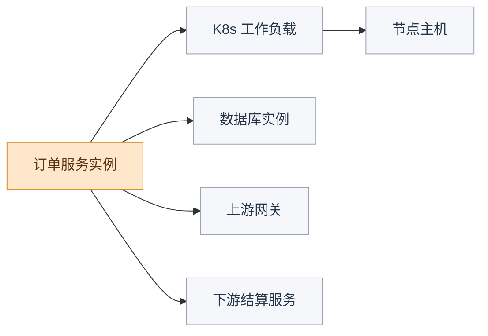
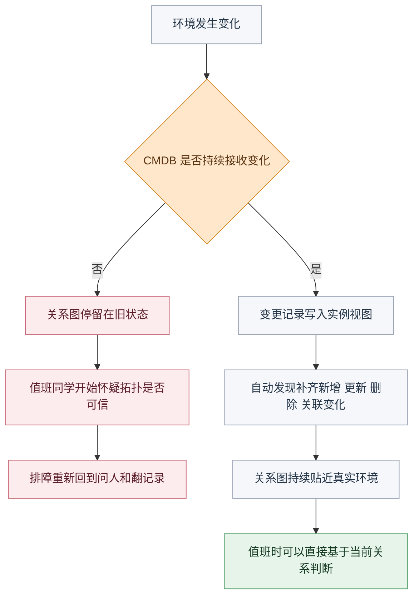
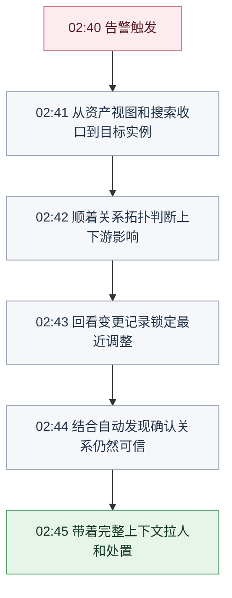

# CMDB 真正失灵的时刻，不是查不到资产，而是查不动关系

## 进了系统，还是停在外围

先把现场拉近一点。主角是某金融客户的 SRE 值班同学小李。

> **2:40** 核心交易接口 P99 从 200ms 飙到 8 秒，告警群开始刷屏。  
> **2:41** 监控把问题指向订单服务所在主机 `10.20.31.47`，CPU 跑满，日志里全是异常。  
> **2:42** 小李打开 CMDB，搜到了这台机器。资产名、IP、机房、负责人，信息齐齐整整。  
> **2:42 之后……真正的问题才开始。**

很多团队对 CMDB 的失望，往往就发生在这一刻。它能告诉你“这是谁”，却回答不了“它牵动了谁”。

<!-- truncate -->

<strong>真正把人卡住的，往往不是对象没搜到，而是关系从这里开始断了。</strong>

因为接下来决定这次故障要不要升级、要不要摘流量、要不要拉更多人进群的，从来不是“对象搜到了没有”，而是下面这几件事能不能立刻回答出来：

- 它现在跑在哪个工作负载、哪个节点上
- 它背后连的是哪套数据库和缓存
- 这条依赖链最近有没有被改过
- 如果这一层出问题，会不会继续影响上下游服务

资产名、IP、负责人、所属业务，看起来都在。

可排查一往前走，值班同学要的就不再是一条静态记录，而是一条能继续往下追的判断链。

如果这些问题还得靠问人、翻 Wiki、翻聊天记录，那它解决的只是“登记”，没有解决“排障”。

更麻烦的是，这种失灵不是一下子炸出来的，而是会跟着排查一步步露馅。

刚开始只是“对象搜到了”，再往后就变成：

- 关系接不上
- 影响不敢判
- 变更对不上
- 拓扑也不敢信

很多团队就是在这几步里第一次意识到，自己手里的 CMDB 其实还停留在台账阶段。小李看上去已经进了系统，实际上还站在故障外围。

## 病根：台账在，关系不在

把锅甩给“录入不全”最省事，也最容易让人心安。但很多团队的真实情况不是没有数据，而是有数据却用不上。小李他们那套 CMDB 录入率并不低，资产是齐的，链路是断的。

这背后的病根通常只有一句话：

> **CMDB 被当成了静态的资产清单，而不是一张持续更新、能被排障消费的关系图。**

<strong>台账能回答“它是谁”，关系图才有资格回答“它影响了谁”。</strong>

这种错位一到故障现场，通常就会裂成四个连续断点：

| 断点 | 现场里的表现 | 直接后果 |
| --- | --- | --- |
| 🩹 模型口径不稳 | 同类对象字段写法不一致 | 检索一开始就拿不到完整视角 |
| 🧭 定位路径不顺 | 搜到了对象，却很难继续收口 | 值班同学在多个列表里来回切换 |
| 🕸️ 关系组织不起来 | 知道实例是谁，却看不出它牵动了谁 | 影响范围只能靠人脑补图 |
| ♻️ 关系持续性不足 | 图上有链路，但不知道现在还能不能信 | 变更一多，排障又回到问人和翻记录 |

下面顺着这场故障继续往下拆，就更容易看清楚，为什么很多 CMDB 看上去“什么都有”，真到出事时却总差最后一截。

## 技术洞察：关系要能被消费

小李卡在 2:42 的那个瞬间，表面上看是在“继续查不到东西”。

但往深一层看，真正失效的其实是关系数据的使用方式。

这类问题背后，有一个常被忽略的前提：**关系数据只有被持续使用，才算真的成立。**

- 可看：值班同学能不能先看到一张有效的对象视角，而不是一上来就盲搜
- 可查：锁定实例之后，能不能顺着拓扑、关联关系和变更记录继续往下追
- 可消费：这些关系数据能不能被排障、影响分析、订阅通知和后续动作真正消费起来

如果一份关系数据只是“存进库里”，平时看不到，出事时查不顺，后续流程也接不上，那它就还不是排障底座。

这也是为什么，小李明明已经打开了系统，还是会觉得自己没有真正进入现场。

BK Lite CMDB 的切入点，不是再做一份更完整的资产清单，而是把对象之间的关系做成一种可以持续消费的数据能力。

这里最关键的是四件事：

- 🧱 模型定义关系
- 📦 实例承载关系
- 🕸️ 拓扑呈现关系
- ♻️ 自动发现和订阅持续更新关系

只有这样，关系才不会停在一张被动附表里，才会真正进入运维现场。

下面这四层，其实就是值班同学在同一场故障里连续撞上的四次卡顿。

## 为什么总会卡住：四层没接住

回到刚才那场订单超时故障。小李从第二步开始卡住，通常不是因为某一项能力彻底没有，而是因为下面四层一直没真正接起来。

他每往前走一步，问题都不会结束，只会换一种形式继续卡住。

### 一、模型口径

他先想评估影响面，在 CMDB 里搜“所有生产环境的支付链路主机”，结果先被第一下绊住了。有人把环境写成 `prod`，有人写成“生产”，自动发现脚本跑出来的还是 `production`，负责人字段也有人填个人、有人填值班组。

结果看起来像搜到了，其实一开始就已经歪了。

**模型标准没立住，后面所有检索、比对和关系判断都会跟着变形。**

#### 为什么会乱

模型管理表面上像后台配置，实质上却是在规定系统里的对象该用什么语言被理解。

这里真正决定后面能不能顺下去的，是三件事：

- **🧱 分类怎么分**
- **📏 字段怎么约束**
- **🔗 关系怎么声明**

这三件事决定了，同一类对象能不能被用同一种方式检索、对齐和消费。

#### BK Lite 怎么统一

BK Lite CMDB 在模型层提供：

- **🧱 分类组织**
- **📐 模型标准化定义**
- **🧩 模型复制复用**
- **🗂️ 字段分组**
- **🔗 关系定义**

这些能力的价值，不在“能不能把模型建出来”，而在先把对象的语言统一起来。

**因为没有统一语言，后面就不会有统一关系。**

到这里还只是“信息不整齐”。

可对值班同学来说，这种不整齐不会停在字段层面。下一步他就会发现：对象明明在系统里，却还是很难迅速收口到正确实例。

### 二、实例检索

#### 为什么难收口

小李放下那个搜不全的列表，回到眼前主机 `10.20.31.47`，很快又撞上另一个常见问题：搜到，不代表顺手找到。

这时候他不是没有入口，而是入口太散。监控里只有 IP，手里只有这一串数字，系统却还在逼他先做分类题。

很多团队以为“有搜索框、有列表页”就等于具备了定位能力。

但真正的故障定位，其实有两个动作：

- **🗺️ 先从全局视角建立认知**
- **📍 再把问题收口到具体对象**

少了前者，小李会盲搜。

少了后者，他会在多张列表间来回切换。

#### BK Lite 怎么收口

BK Lite CMDB 的资产视图和资产列表，解决的正是这两个阶段。

资产视图先帮值班同学建立对象分布和数量的直观认知，资产列表再结合模型树、搜索和筛选，把范围一步步缩到目标实例。

这样做的意义，不只是界面更顺。

它真正改变的是排障动作本身：把“我先试着搜搜看”，变成“我知道该从哪一步收口”。

这张图想说明的不是“检索步骤很多”，而是**定位能力本身就该是一条连续路径**。

值班同学先建立全局认知，再逐步收口到实例，和一上来就在多个列表里盲搜，完全不是一回事。

如果缺了这一层，CMDB 提供的仍然只是散数据，而不是排查入口。

可就算实例终于找到了，值班同学也还不能松口气。

更难的部分，是从“找到对象”切换到“判断这条链到底影响了谁”。

### 三、关系拓扑

小李终于锁定了当前实例，下一步马上会问：这次异常到底会压到哪里？

到这里，他要的已经不是对象信息，而是影响判断。

这个问题一出来，CMDB 就不能再只回答“它是谁”，而必须开始回答“它连着谁”。

这也是很多系统最容易失手的地方。

关系字段可能已经存了，关联记录也可能已经配了。

但这些关系没有被组织成一张可继续展开的结构，于是它们看上去在，排障时却用不上。

#### 为什么图会失真

问题通常不在“有没有录”，而在“有没有继续维护”。

关系一旦不能持续补录、修正和展开，就会慢慢变成一种半真半假的信息。

最糟的是，小李并不会在平时就发现它失真。

他只会在故障现场第一次意识到：**图里有关系，不等于我现在能拿它判断影响范围。**

#### BK Lite 怎么展开

BK Lite CMDB 在这里做得比较关键的一点，是把模型关系以图边形式存储，并把基础信息、关联关系和变更记录组织到同一实例视角里。

这样一来，小李锁定当前实例后，不需要再把工作负载、节点主机、数据库实例、上下游服务拆开分别查，而可以围绕当前对象一直往下走。

这张图的重点，不是展示“关系很多”，而是说明故障排查真正需要的是一条**能持续展开的判断路径**。

小李不是想看一张漂亮拓扑图。

他真正想知道的是三件事：

- 📍 这次异常到底落在哪个节点
- 🔗 压到了哪套依赖
- ⚠️ 会不会继续影响后面的服务

当拓扑支持按层展开、节点扩展、路径追踪和影响分析时，关系才从“存在”变成“可查”。

如果没有这一层，小李即使知道系统里存着关系，也还是得在脑子里自己补图。

但现场真正让人犹豫的，往往还不是“图能不能展开”，而是“这张图到底敢不敢信”。于是第四层问题就出来了。

### 四、变更同步

#### 为什么最后不敢信

到这里，小李终于把服务和上下游串起来了。

可更现实的问题马上就来了：这张图现在还能信吗？

这正是很多 CMDB 最后失灵的地方。关系图一开始不是没建，而是环境一变、配置一调、部署一迁移，它就开始慢慢过期。真正让关系失真的，往往不是少了一次导入，而是少了后续的变更留痕和持续写回。

BK Lite CMDB 在实例详情里把变更记录和关系视图放在一起，实例创建、修改、删除和关联变更都能追到操作人、时间和前后值。

这样做的价值，不只是审计，而是让小李在怀疑“是不是刚改过”时，能马上缩小排查范围。

但仅有变更记录还不够，因为很多关系变化并不是人工手动维护出来的，而是环境自己一直在变。

#### BK Lite 怎么补回

##### 4.1 变更记录

如果小李在实例详情里能直接看到“23:42 有人改过 JVM 参数”，那一整段跨系统接力赛就会被压掉。自动发现真正承担的职责，就是把新增、更新、删除、关联和异常这些变化重新写回到关系图里。

##### 4.2 自动发现

文档里明确给出了自动发现的结果摘要、20+ 采集插件、K8s 全景发现和关系自动恢复能力。这说明它解决的不是一次性盘点，而是关系数据的持续鲜活度。

这张图补的是第四层里最关键的机制差异。

问题不是“系统里有没有一张拓扑图”，而是这张图有没有被变更记录和自动发现持续喂新。

只有右边这条链成立，小李才会真的信它。

换句话说，小李最后能不能相信这张拓扑图，不取决于它画得多漂亮，而取决于它有没有被持续更新。

走到这里，再回头看最开始那场故障就会发现：问题从来不是“系统里有没有资产”，而是模型、定位、关系和持续同步能不能连成一条真正能用的判断链。

## 收束：把四层重新串起来

如果把前面这四层真正接起来，小李在故障现场经历的就不该是“搜到了，但还是一路卡住”，而应该更接近下面这条被压缩过的排障路径：

这张图不是为了制造一个“理想产品宣传场景”，而是为了把前文四层拆解重新收回来。

这里真正被压缩掉的，是四段本来很慢的人肉判断：

- 📍 先拿到对的对象
- 🧭 再迅速收口
- 🕸️ 再判断影响范围
- ♻️ 最后确认这张图现在还能不能信

少一层，小李就会重新回到最慢的那条路上。

这也是为什么，故事里最扎心的地方从来不是“系统里没东西”，而是“系统带你走了两步，然后停住了”。

## BK Lite 的切入点：关系治理

把前面这四层连起来，就更容易看清楚：BK Lite CMDB 真正切入的，不是再做一份资产清单，而是把关系数据做成故障现场真正能消费的运维能力。

| 排障阶段 | 现场真正卡住的问题 | BK Lite CMDB 对应能力 |
| --- | --- | --- |
| 刚接到告警 | 只知道服务名，但不知道该从哪层开始看 | 资产视图、资产列表、检索收口 |
| 找到实例之后 | 对象找到了，上下游仍然是断的 | 模型关系、实例关联、拓扑视图 |
| 怀疑近期调整 | 不知道是不是刚有人改过配置或关系 | 变更记录追溯 |
| 环境持续变化 | 图上的链路和真实环境慢慢脱节 | 自动发现、关系自动恢复 |
| 想持续关注关键对象 | 每次都要人工回查，不能主动感知变化 | 数据订阅与通知 |

这张表的重点，不是把产品功能再列一遍，而是说明这些能力为什么必须是一条链。

模型层定义关系，实例层承载关系与变更，发现层负责持续写回，订阅层把关键变化推出去。

只有这一整条链成立，CMDB 才不只是一个“存数据的地方”，而是排障现场真正能依赖的关系底座。

## 自查清单：先看 4 件事

- 🩹 模型口径是不是统一的：名称、环境、负责人、状态、关系约束有没有标准化
- 🧭 定位路径是不是顺手的：能不能从全局视图快速收口到目标实例
- 🕸️ 关系和变更是不是放在一起的：排障时还要不要跨系统拼信息
- ♻️ 自动发现是不是日常机制的一部分：关系图会不会随着环境变化持续更新

这四件事里，前两件决定“找不找得到对象”，后两件决定“找到以后能不能继续判断”。很多团队之所以觉得 CMDB 在故障现场帮不上忙，不是因为四件事全都没有，而是因为只做成了前一半，后面真正决定排障效率的那一半始终没接上。

<strong>排障现场最怕的，不是没有系统，而是系统把人带到门口就停住了。</strong>

## 结语

很多团队真正卡住的，从来不是 CMDB 没建，而是它一直没有从台账系统进化成关系系统。

当模型标准、实例检索、关系拓扑、变更追溯和持续同步没有接成一条链时，故障现场面对的就仍然是一堆孤立记录。

而当这条链真正接起来，CMDB 才会从“有台账”变成“能排障”。

这也是 BK Lite CMDB 更值得进入一线运维链路的原因：它提供的不只是资产登记能力，而是一种让资产关系真正活起来、并能被现场持续消费的方式。

换句话说，CMDB 的价值从来不在“你录进去了多少对象”，而在“出了故障的时候，有多少团队会第一时间打开它，而且打开之后真的能继续往下走”。这才是它该扮演的角色。
