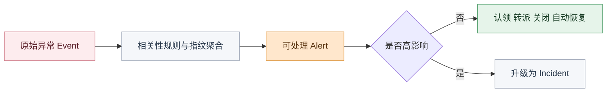
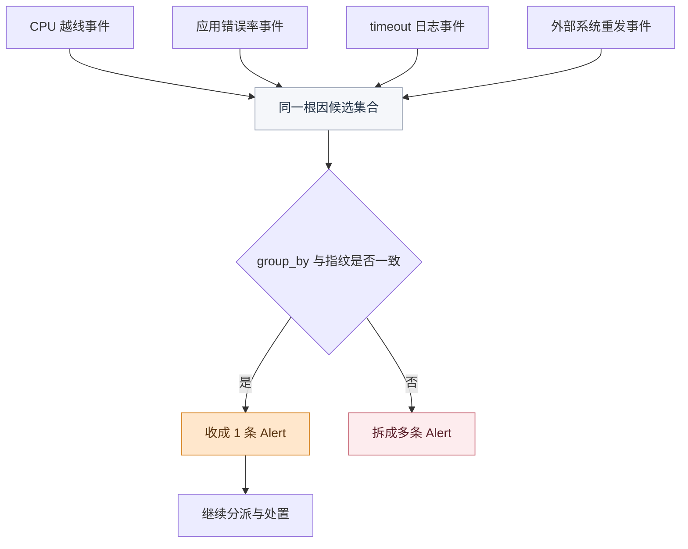
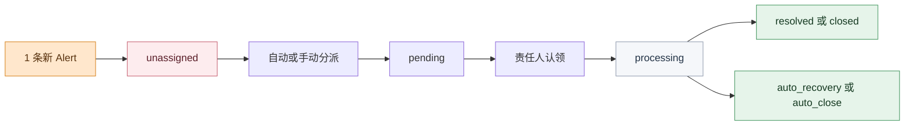

# 10 条告警背后其实是 1 个问题，如何高效治理

## 开场：10 条里真正该接哪 1 条

发布刚结束，告警列表已经刷出一排红色状态。

主机指标在抖，应用错误率在涨，日志平台也在冒异常，群里几分钟就被不同来源的提醒顶满了。平台排障同学老钱盯着列表，没有立刻去逐条认领。不是他反应慢，而是他知道，这种时候最怕的不是没人看到问题，而是**所有人都被 10 条看起来同样着急的告警同时拉走注意力**。

真正困难的地方，很少是“有没有发现异常”。

真正困难的地方是：**这 10 条里，到底哪一条才是处理单位。**

<!-- truncate -->

<strong>告警治理真正要解决的，不是把消息发出去，而是把同一个问题收成少量值得接手的对象。</strong>

如果平台只是把不同来源的异常继续往外推，一线看到的就不会是上下文，而是一堆互相抢注意力的碎片。10 条看起来都重要，最后反而没人敢先判断哪条该优先处理。

这也是为什么，很多团队以为自己是“告警太多”，实际上真正卡住他们的，是平台还没有把原始事件和处理对象拆开。

## 病根：消息很多，处理单位很少

同一个故障为什么会炸出 10 条告警？原因通常并不复杂。

- 同一台资源上的多个指标同时越线
- 上游系统在问题没恢复前持续重发
- 抖动型异常在短时间里反复出现
- 不同监控源从各自视角重复描述同一个根因

表面上看，这是 10 个异常同时爆了。

往深一层看，很多时候却只是同一个问题在不同链路里反复露头。

问题就出在这里：平台如果把这些原始信号都直接当成“要处理的告警”，现场就会很快失真。数量很多，不等于问题很多；响得很凶，也不等于每一条都值得认领。

<strong>一线最怕的不是告警多，而是“原始事件很多”和“真正该处理的对象很少”这件事，没有被平台提前拆清。</strong>

这也是告警中心里几个看起来相近、其实职责完全不同的对象必须被分开的原因：

- Event 负责承接原始事件
- Alert 负责承接真正进入处理流程的问题单元
- Incident 负责承接更高影响、更需要协同的问题

只有这三层被拉开，平台才不会把所有红点都扔给一线自己解释。

## 技术洞察：三层对象，三层职责

很多团队做告警治理时最容易犯的错，就是把 Event、Alert、Incident 当成同一件事的不同名字。

实际上，它们分别对应三种完全不同的职责：

- Event：原始输入，回答“发生了什么”
- Alert：处理对象，回答“现在该接什么”
- Incident：高影响协同对象，回答“问题是否已经升级到更高层面”

如果这三层不分开，一线收到的就不会是一条可以认领、可以流转、可以恢复的告警，而是一团还没整理过的原始信号。

这张图想说明的不是平台里对象变多了，而是**处理单元必须分层**。

老钱真正需要的不是看到更多事件，而是尽快拿到那条已经被收成 Alert 的问题对象。只有这样，后面的认领、分派、关闭、恢复，才不会都建立在一堆未整理信号上。

## 为什么会越响越乱：三层没接住

回到刚才那个告警刷屏的现场。老钱迟迟没有动手，不是因为平台什么都没做，而是因为下面三层如果有一层没接住，列表看上去就会立刻失真。

### 一、事件收敛

同一个根因最容易把现场拖乱的第一步，就是原始事件没有先被收一层。

事件源很多并不可怕，可怕的是平台没有先帮人做“哪些本来就是同一个问题”的判断。主机指标、应用报错、日志异常和外部系统回调失败，可以在同一时间一起冒头，但它们不该天然变成四条彼此平行的处理单。

#### 为什么会炸开

告警中心的相关性规则，本质上就是在回答一件事：哪些事件应该继续分开看，哪些事件应该先聚成一个问题对象。

文档里给出的能力边界很明确：

- 通过相关性规则定义匹配条件
- 通过 group_by 定义聚合维度
- 通过指纹算法把同一问题去重
- 通过滑动窗口、固定窗口、会话窗口控制“在多长时间里算同一件事”
- 通过观察期把短抖动挡在正式告警之前

这层没做好，老钱看到的就不再是“问题”，而是“问题的碎片”。

#### BK Lite 怎么收

BK Lite 告警中心在这一层给的是完整的收敛链路，而不是单点去重：

- Event 先作为原始数据进入平台
- 智能降噪规则负责做匹配和聚合
- group_by 负责定义什么才算同一个处理对象
- 会话窗口和观察期负责过滤会自己恢复的短抖动
- 相同指纹的活跃告警更新而不是重复创建

<strong>10 条压成 1 条，价值不在“列表更短了”，而在一线终于能先看对对象。</strong>

但走到这里，问题其实只解决了一半。1 条留下来了，不代表它就一定会被谁接住。

### 二、责任流转

很多团队把告警数量压下来以后，会立刻掉进第二个坑：以为红点少了，治理就完成了。

事实上，真正拖慢响应的，经常不是没人看到，而是所有人都看到了，却没人确定这条该归谁。老钱最熟悉的场景就是：群里每个人都盯着同一条告警，但没人先点认领，因为大家都在等“更合适的人”出现。

#### 为什么还是没人接

如果一条 Alert 没有清晰的状态流转和责任流转，它就只是一条被压缩过的红点，仍然不是稳定的处理单元。

文档里这部分的能力边界也很明确：

- Alert 有明确状态机：unassigned、pending、processing、resolved、closed、auto_recovery、auto_close
- 支持手动分派、认领、转派、关闭
- 支持自动分派和兜底分派
- 支持按时间范围和字段条件做分派策略

这层真正解决的，不是谁先看到，而是谁先接住。

#### BK Lite 怎么接住

BK Lite 把“看到异常”和“开始处理”之间的那段责任空白补得比较完整：

- 告警列表支持按级别、状态、来源、“我的告警”筛选
- 列表上就能直接认领、转派、关闭
- 分派策略可按单次、每日、每周、每月生效时间配置
- 没命中策略的告警还能进入兜底通知链路

这部分的价值很直接。告警如果只是被收敛，而没有进入清晰的责任闭环，老钱最终还是得回到群里手工喊人。只有归属先被理顺，MTTR 才真正有下降的基础。

但再往下一步，治理也不能滑向另一个极端：为了让列表好看，把所有东西都压下去。

### 三、治理边界

告警治理做到后面，最容易出现的第三个误判，就是把“少”误当成“好”。

老钱真正需要的不是一个安静得什么都不响的平台，而是一个**该响的时候留下来，不该响的时候挡在前面**的平台。能聚合、能观察、能屏蔽，价值不在于把数字压得越低越好，而在于把处理单位和无效噪声认真分开。

#### 哪些该挡住

产品文档里这部分的边界主要体现在三件事上：

- 屏蔽策略命中后，事件会进入 SHIELD 状态，不进入后续链路
- 恢复事件覆盖创建事件后，可自动推动告警恢复
- 高影响问题可以一键升级成 Incident，进入更高等级协同

这意味着治理不是只有“压缩”一个动作，而至少有三种不同处理：

- 低价值、计划内、无需处置的，前置屏蔽
- 同一问题不同碎片的，相关性收敛
- 已经具备更高业务影响的，升级 Incident

#### BK Lite 怎么划边界

BK Lite 在这一层的价值，不是让告警列表看起来更安静，而是把“边界”做出来了：

- 屏蔽策略可以把维护窗口、低价值通知挡在前面
- 自动恢复可以避免问题好了，旧告警还继续挂着
- Incident 可以承接已经超出“单条告警”处理范围的问题
- 操作日志还能把这些治理动作保留下来，方便后续追溯

<strong>好的告警治理不是让系统尽量少响，而是让真正该被处理的那一条，留下来以后更清楚、更敢接、更不会被埋。</strong>

## 收束：真正被压缩掉的是什么

如果把前面三层重新串起来，平台真正替一线压缩掉的，从来不只是“9 条列表项”。

它压缩掉的其实是三段最慢的人肉动作：

- 先自己判断哪些其实是同一个问题
- 再自己判断这条到底该归谁
- 最后还得自己判断这条是不是根本不该留下来

也正因为如此，标题里的“只该处理 1 条”，从来不是说另外 9 条不重要。

真正的意思是：那 9 条多数时候只是同一个问题在不同视角下的外显，不应该被当成 9 张彼此独立的工单去打。

## BK Lite 的切入点：把问题还原成行动对象

把整条链路放在一起看，就更容易理解 BK Lite 告警中心真正切入的是什么。

| 治理阶段 | 现场真正卡住的问题 | BK Lite 对应能力 |
| --- | --- | --- |
| 原始异常进入平台 | 数据源很多，先天就容易重复 | 多源接入、字段标准化、Event 承接 |
| 同类事件持续进入 | 同一个根因被拆成很多红点 | 相关性规则、指纹聚合、group_by、窗口与观察期 |
| 留下告警之后 | 看得见，但没人先接 | 状态流转、认领、转派、自动分派、兜底通知 |
| 治理边界收口 | 不知道哪些该屏蔽、哪些该升级 | 屏蔽策略、自动恢复、Incident 升级 |
| 事后复盘 | 想知道平台到底做过什么 | 关联事件回看、操作日志、通知状态追踪 |

这张表的重点，不是再列一次功能，而是说明：BK Lite 处理的不是“通知怎么发得更多”，而是“问题怎么更早被还原成行动对象”。

## 自查清单：先看 4 件事

- 你们现在收到的，究竟是很多原始 Event，还是已经被整理过的 Alert
- 同一个根因下的多源异常，有没有通过相关性规则和 group_by 收成同一条处理对象
- 这条留下来的 Alert，能不能立刻进入认领、转派、关闭或自动恢复的责任闭环
- 屏蔽、观察、升级 Incident 这些边界动作，是否真的在帮团队区分“该挡住的”和“该留下的”

这四件事里，前两件决定你能不能把噪声先收住，后两件决定你能不能把留下来的那条真正处理好。

## 结语

同一个故障为什么最后只该处理 1 条？不是因为另外 9 条没有价值，而是因为它们多数时候只是同一个问题在不同系统里的回声。

告警治理做到最后，真正重要的从来不是通知数量，而是处理单位是否被定义清楚。Event 要保留追溯价值，Alert 要承接处理责任，Incident 要承接更高等级协同。只有这三层分开，一线才不会被一堆同时响起的红点拖进重复劳动。

BK Lite 告警中心真正补上的，也不是“让平台再多发几条消息”，而是让平台先替团队把问题收一层、分一层、再交到对的人手里。这样一来，10 条炸开的告警背后，团队最终面对的才会更像 1 个真正可以行动的问题对象。
