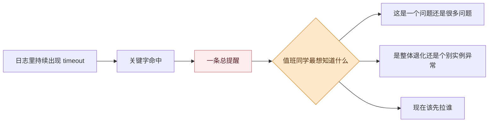
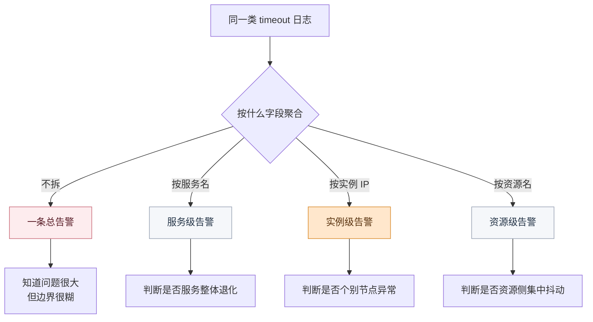

# 日志告警总像“狼来了”，问题卡在哪

## 复盘会上最扎心的那句：这到底是一件事，还是十几件事

周三例行发布刚结束，发布群里连续刷出十几条 timeout 相关提醒。

订单服务在报错，支付回调也在报错，几个实例日志里都能看到相似关键字。发布负责人老赵打开日志中心，先搜 `timeout`、`Exception`、`upstream reset`，再回头看告警列表。

真正把人卡住的，不是页面上没有信息，而是信息一下子太多了。

复盘会上有人追问了一句很刺耳的话：

> 这些提醒到底是在说同一个问题，还是已经是十几条不同的处理对象？

页面上不是没有信息，恰恰相反，是**信息太多了**。同一类错误在不断冒出来，告警一条接一条地刷，群里每个人都知道“出事了”，但没有人能立刻回答更关键的问题：**这到底是一个问题，还是十几个问题？**是某个服务整体退化，还是个别实例异常？该先拉谁，先看哪一层，先不先升级？

很多团队以为自己是被日志量压垮的，真正把人拖慢的，往往不是日志太多，而是告警在一开始就没有把 **处理单位拆清楚**。关键字告警和聚合告警都能工作，但它们回答的根本不是同一个问题。前者在抓信号，后者在划责任边界。如果这两件事混着做，发布后的排障现场就会越来越像“狼来了”。

<!-- truncate -->

<strong>真正让人迟疑的，往往不是日志太多，而是系统没有尽快交出“现在到底该处理哪一条”。</strong>

## 病根：日志异常看见了，告警对象没拆清

回过头看这场凌晨故障，最扎心的地方并不是“系统没响”，而是“系统响了，但大家还是先等等看”。

这背后的病根通常只有一句话：

> **日志异常已经被看见了，但告警对象还没有被定义清楚。**

这种错位在发布后的排障现场通常会同时表现成三层问题：

| 断点 | 排障现场里的表现 | 直接后果 |
| --- | --- | --- |
| 🧩 抓信号和划对象混在一起 | 一条宽泛关键字规则把很多异常都卷进来 | 大家知道有事，但不知道是几个事 |
| 🧭 聚合边界没讲清楚 | 同样的 timeout 不知道该按实例、服务还是资源拆 | 无法判断是局部异常还是整体退化 |
| ♻️ Event 没收成真正的 Alert | 告警刷屏，但没有稳定的责任边界和状态流转 | 处理动作总要回到人肉判断 |

也就是说，老赵真正被拖慢的，并不是“日志太多”，而是“系统一直在响，却没有把**值得处理的问题稳定交出来**”。下面顺着这次发布后的排障继续往下拆，就会更容易看清关键字告警、聚合告警和告警中心各自该承担什么角色。

## 为什么总像“狼来了”：三层没有接起来

### 一、关键字告警：先抓信号，别先拆责任

老赵先在日志中心里搜到了大量 timeout 日志。

这一步其实不难。检索、分组、查询语句和直方图，已经足够让他快速判断异常是不是在短时间内集中爆发，终端模式也适合继续盯实时流入的数据。

真正的问题不是“看不见日志”，而是**“看见之后怎么把它变成可处理对象”**。

因为接下来真正影响排障效率的，不是日志里有没有报错文本，而是下面几件事能不能被迅速区分出来：

- 这批日志是在提醒同一类风险信号，还是已经能代表一条具体待处理的问题
- 同样的 timeout，到底是 12 个实例一起抖动，还是只有 1 个实例出问题
- 老赵现在面对的是一条该先扩散通知的总告警，还是几条应该分别认领的对象级告警
- 后面进入告警中心后，这些事件是该继续合并，还是应该拆开保留责任边界

也正是在这里，很多团队第一次发现，自己并不是“告警太多”，而是“告警对象没有被定义清楚”。

这张图想说明的不是关键字告警没用。

它真正点出来的是：**关键字告警先给了你信号，但还没有给你对象。**

老赵在这一层听到的是提醒声，真正想拿到的却是**处理单位**。

#### 这一层先解决什么

刚开始收第一波信息时，老赵最先依赖的，通常还是关键字告警。

这个选择没有问题。

因为在故障刚发生的时候，团队最先需要回答的往往就是一个直接问题：某类危险信号有没有出现过，而且是不是已经开始持续出现。

<strong>这一层先解决的是“有没有危险信号”，还不是“到底该接哪一条问题”。</strong>

日志中心在这一层的能力是明确的：

- 通过检索、分组和保存查询条件快速定位异常
- 在日志事件策略里配置关键字告警
- 把数据库连接失败、固定错误码、下游调用超时这类强文本特征异常先汇成一个入口

这也是为什么关键字告警经常在系统上线初期特别“好用”。

因为它确实擅长抓住信号，让团队第一时间知道某类风险已经开始出现。

但问题也恰恰从这里开始。

<strong>关键字告警更像统一提醒，它先把风险喊出来，但不会替你把责任边界拆开。</strong>

#### 为什么它不能替你拆对象

关键字告警更像统一提醒，它天然不负责帮你把责任边界拆到实例级、服务级或者资源级。

如果很多服务都套同一条宽泛策略，那么老赵听到的只会是一声很响的警报，却很难马上判断这声警报背后到底对应几个处理对象。

到这里，他其实已经知道“有异常了”，但还不知道该不该拉更多人进群，也不知道该不该把某个实例单独摘出来看。

问题不在信号没抓到，而在**信号太快被误当成了处理对象**。

## 技术洞察：真正要留下能处理的 Alert

老赵在发布后的前几分钟里真正缺的，已经不是更多日志，也不是更响的提醒。

他缺的是一条**自己敢信、敢接、敢往下处置的告警对象**。

日志告警做得好不好，核心不在于规则配了多少，而在于最后留下来的那条 Alert 能不能被相信。

- 🧲 抓信号：有没有出现某类危险文本，值得提醒值班同学先看一眼
- 📍 划对象：这批异常到底该算一个问题，还是应该按实例、服务或资源拆成多个处理单元
- ♻️ 收敛处置：进入告警中心后，哪些事件应该继续合并，哪些应该保留独立上下文，方便认领、转派和恢复

如果一条策略只能告诉团队“最近很多日志不太对”，却不能告诉团队“现在应该处理哪一条、由谁来处理、影响范围怎么判断”，那它制造的就不只是提醒，而是迟疑。

这也是为什么关键字告警和聚合告警不能混着理解。它们都能从日志里产生告警，但落点完全不同。

下面第二层，老赵碰到的就是这个“落点不同”带来的卡顿。

### 二、聚合告警：先讲清边界，再谈降噪

也正因为关键字告警只解决“有没有信号”，排查往前走一步，团队很快就会碰到下一层问题：这一波 timeout，到底该看成一个问题，还是多条问题？

这时候，老赵最怕的不是系统不响，而是它把很多本该拆开的异常，继续混成一团推过来。

这时候才轮到聚合告警真正发挥作用。

#### 聚合到底在拆什么

日志中心提供的聚合告警，本质上是在告诉系统要按什么字段来切处理对象。

它支持根据特殊字段分类，按字段单值生成各自的 Alert。最常见的拆法就是按实例 IP、服务名、资源名这类能定义责任边界的字段去分。

这张图补的是第二层最容易被讲糊的地方。

问题不是“要不要再响一次”，而是**同一波异常到底该被拆成几条处理对象**。

字段一换，值班同学看到的就不再只是噪声大小，而是责任边界本身。

<strong>第二层真正要讲清的，不是“聚合更高级”，而是“同一波异常到底该按什么边界拆开”。</strong>

假设同样一条 timeout 日志同时出现在 12 个实例上，如果继续只用一条总的关键字告警，老赵只能得到一个模糊判断：超时很多，问题很大。

但如果按服务名或实例 IP 聚合，他就能很快看出这到底是服务整体退化，还是个别节点异常。

#### “有没有”和“算几个”不能混用

关键字告警和聚合告警的差别，不是“谁更高级”，而是谁在定义处理单位。

- 关键字告警回答“有没有”
- 聚合告警回答“算几个”

<strong>一旦“有没有”和“算几个”混在一起，值班同学听到的就只剩下一声很响、但很难接手的警报。</strong>

这也是很多团队容易配错的地方。

把聚合告警当成关键字告警的加强版，就会不停往一条规则里塞更多关键词；把关键字告警当成聚合告警来用，就会指望它天然替你完成实例级责任拆分。

结果就是日志一直在响，但告警对象始终虚着。

问题走到这里，老赵才会第一次意识到，自己真正缺的不是另一条更响的策略，而是一条能把**问题边界讲清楚**的规则。

可就算对象已经拆出了轮廓，发布后的排障面对的仍然不是原始事件本身，而是能真正进入处置流程的告警单元。

### 三、Event 到 Alert：把响声收成处理对象

老赵把对象拆清楚之后，问题还没结束。

因为发布后的排障面对的，通常不是一条条原始日志事件，而是能认领、能转派、能追溯、能恢复的处理单元。

#### Event 和 Alert 差在哪

告警中心承接的，正是从 Event 到 Alert 的这一步。

事件是外部系统接入的原始异常数据，告警则是相关性规则聚合之后形成的可处理对象。

对老赵来说，差别非常直接：Event 说明“发生了什么”，Alert 才真正说明“现在该处理什么”。

<strong>第三层真正收口的，是把“很多原始事件”变成“少量可以认领、可以流转、可以恢复的处理对象”。</strong>

#### 告警中心真正收的是什么

告警中心这一层的价值，不是简单再做一次展示，而是通过相关性规则、聚合维度、窗口类型和观察期，把重复事件收成稳定的处理对象。

这里最关键的其实只有三件事：

- 哪些字段应该进入 `group_by`
- 多长时间内应该合并看待
- 哪些短抖动应该先被观察而不是立刻放大

这张图想说明的重点，不是链路有多长，而是告警治理真正有价值的部分并不发生在“日志有没有报错”这一步，而发生在“这些报错如何被收成一个值得处理的对象”。

如果前面没有把关键字告警和聚合告警的边界分清，后面的相关性规则就只能继续替一笔糊涂账擦屁股。

而一旦 Event 被稳定收成 Alert，告警中心后面的价值才会真正出现。

状态流转让老赵知道问题现在处在未分派、待响应、处理中还是已恢复；认领和转派让责任边界进入处理流程；关联事件回看又把原始上下文保留下来，方便理解这条 Alert 为什么会形成。

到这里，团队听到的就不再是反复刷屏的“狼来了”，而是几条真正值得进入处置流程的问题单元。

<strong>告警治理真正要压下去的，不是响声本身，而是那种“大家都听见了，却还想先等等看”的迟疑。</strong>

## 把三层串起来：为什么最后总会回到“先等等看”

如果把这次发布后的排障重新顺一遍，问题链路其实很清楚：

- 日志中心先把异常信号捞出来，告诉团队“确实有事了”
- 聚合告警再把同类异常按字段拆清，告诉团队“现在到底是几个问题”
- 告警中心继续把 Event 收成稳定的 Alert，告诉团队“这几条问题该由谁接、怎么流转、什么时候恢复”

这三步里少了任何一步，老赵都会重新退回到最熟悉但也最慢的做法：先看着，先等等，再靠人脑补上下文。

所谓“狼来了”的根源，并不只是告警数量多，而是系统一直没有把提醒稳定地收成一个值得被相信的处理对象。

## BK Lite 的切入点：不是“让日志更响”，而是“让告警更可信”

把这几层连起来看，会更容易理解 BK Lite 在日志告警这件事上真正切入的是什么。

| 排障阶段 | 现场真正卡住的问题 | BK Lite 对应能力 |
| --- | --- | --- |
| 刚发现异常 | 只能看到很多 timeout，不知道是不是同一类信号 | 日志检索、分组、保存查询、关键字告警 |
| 想拆清对象 | 不知道该按实例、服务还是资源拆成几条问题 | 日志事件策略中的聚合告警 |
| 想稳定降噪 | 同类事件不断进入，不知道哪些该合并 | 告警中心相关性规则、`group_by`、窗口类型、观察期 |
| 开始处置 | 需要把异常交给具体责任人，而不是继续刷屏 | 告警状态流转、认领、转派、关闭、自动恢复 |
| 回头复盘 | 想知道一条告警为什么形成、为什么恢复 | 关联事件回看、事件与告警上下文追溯 |

这张表的重点，不是把产品功能重新列一遍，而是把一条真实的治理链路讲清楚。

日志中心负责把异常抓出来，告警中心负责把异常收成真正能处理的对象。前者解决“看见”，后者解决“相信”。

## 自查清单：先看这 4 件事

- 你现在配的，到底是在抓危险信号，还是已经在定义处理对象
- 同一类异常有没有按实例、服务或资源拆出明确边界，而不是全堆进一条总告警
- 告警中心的 `group_by`、检测窗口和观察期，是否真的在为降噪服务
- 告警生成之后，责任人能不能直接认领、转派、回看上下文，而不是再回头翻原始日志

这四件事里，前两件决定你能不能把异常讲清楚，后两件决定你能不能把异常真正处理掉。

很多团队之所以总觉得日志告警像“狼来了”，不是因为团队不重视告警，而是因为系统不断把没有责任边界的提醒推到人面前，久而久之，任何人都会先怀疑它是不是又在虚张声势。

## 结语

告警治理做到最后，关键不是规则配得多，而是每一条留下来的告警都值得被相信。

关键字告警适合先抓强信号，聚合告警适合按字段拆清处理对象，告警中心再把 Event 稳定收成可认领、可转派、可恢复的 Alert。

只有这三步接成一条链，团队面对告警时才不会先产生迟疑。

所以日志告警真正的问题，从来不只是“太多”，而是“太多告警在产生时就没有把处理单位拆对”。一旦这一步被理顺，发布后的排障现场听到的就不再是反复刷屏的狼叫，而是几条真正值得马上行动的信号。
