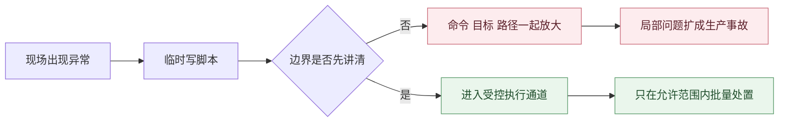
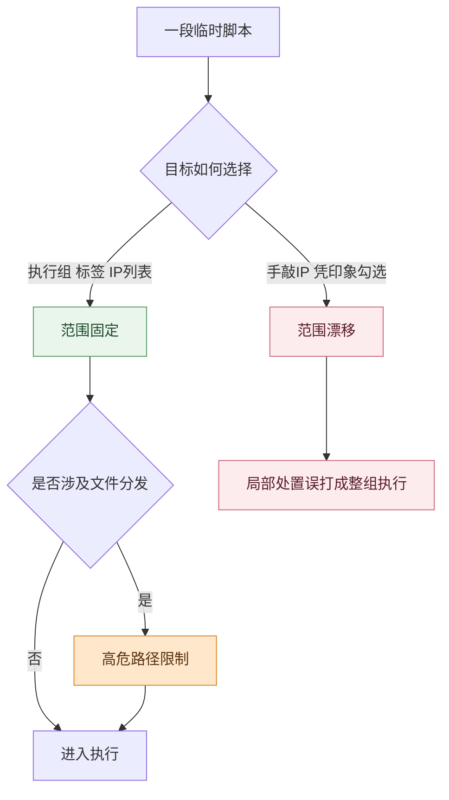

# 生产环境批量跑脚本，风险往往不在脚本里

月末结算窗口前二十分钟，账务集群里有几台机器的磁盘占用突然往上冲。群里没有人先问脚本怎么写，而是先追着确认另一件事：这次到底只处理几台异常节点，还是会顺手打一整个执行组。

让人发紧的，不是要不要批量执行，而是没人敢保证这一键只会落在该落的地方。脚本内容、目标范围、落地路径、执行后的追溯链，只要有一处没收住，原本用于止血的动作就可能直接扩大故障面。很多生产环境里的“自动化翻车”，问题都不出在自动化本身，而是批量能力先跑了起来，边界却还没讲清楚。

<!-- truncate -->

## 病根不在脚本本身

很多团队复盘这类事故时，第一反应是“脚本写错了”。这当然可能成立，但更常见的问题是另一种错位：大家把批量执行理解成“把命令一次发到很多机器上”，却没有把执行前后的约束一起设计进去。

放到月末窗口这类高压场景里，这种错位通常会同时表现成三层失控：

| 失控点 | 现场会怎么表现 | 为什么会被放大 |
| --- | --- | --- |
| 命令边界没拦住 | 临时脚本里混进破坏性语句 | 下发越快，误操作扩散越快 |
| 目标边界没圈准 | 几台异常节点被误选成整组机器 | 处理范围会从局部处置变成整体打击 |
| 追溯边界没留住 | 只看到总成功率，看不到单机输出 | 失败后只能重新连机，人肉回现场 |

团队真正担心的，不只是“脚本会不会错”，而是这次动作有没有被收进一条受控通道。BK Lite 作业管理要补上的，正是这条通道。

## 第一层先拦住危险动作

小周在那次处置里先写的，是一段清理和诊断脚本。他迟疑的点不在语法，而在里面会不会混进任何一条一旦打错范围就会立刻越线的命令。生产环境里的高风险动作，很多时候并不复杂，反而常常就是最短、最顺手、最容易在紧急情况下复制进去的那几句。

这就是为什么作业管理里最重要的第一道门，不是编辑器，而是高危配置与拦截底座。命令提交时会先经过高危命令配置识别，平台支持通过正则策略直接拦截越线语句，而不是先执行、再补救。两者的差别不只是一前一后，而是风险到底停留在页面上，还是已经被送进了机器。

如果这一步缺失，批量能力本身就会变成放大器。人在最赶的时候，很容易把“先执行再说”误当成效率；但对生产环境来说，更重要的是把明显不该发的东西挡在起点，而不是等几十台主机都收到命令后再回头止损。

但命令能不能发，还只是边界的一半。因为生产现场里更常见的翻车，往往不是脚本内容本身，而是它被发给了不该收到它的那批机器。

## 第二层先把对象圈准

到了选择目标那一步，群里的问题马上从“脚本写好了没有”变成“这次到底圈哪几台”。几台测试机和几十台业务节点之间，命名可能只差一个标签；同一个业务池里，也可能只有少数机器真的需要处理。只靠手敲 IP 或凭记忆临场选择，本身就是把生产动作押在运气上。

作业管理把这件事做成了可复用的执行组能力。目标管理支持按标签或 IP 列表组织目标，同时兼容有 Agent 和无 Agent 两种纳管模式。它最重要的价值，不是让勾选主机更方便，而是把“发给谁”从一次性的临场判断，变成可以复查、可以复用、可以稳定沉淀的目标集合。

脚本库和 Playbook 库的意义也在这里。它们不是为了把平台功能堆得更满，而是为了减少每次处置都重新拼脚本、重新拼范围带来的漂移。常见动作如果长期靠临时输入，团队总会在某个高压时刻把局部处置误打成整组执行；脚本和目标一旦能沉淀下来，现场需要判断的变量就会少很多。

如果动作里还带文件分发，第二层边界就要再往前收一格。因为很多事故不是命令写错，而是文件落到了不该落的路径。作业管理对目标路径提供黑白名单限制，高危路径配置会把系统关键目录挡在外面，让分发至少先远离那些一旦覆写就可能直接伤到系统存活的区域。

到这里，团队才算把“发什么”和“发给谁”收住了。可生产现场里还有最后一道边界更容易被忽视：万一还是执行失败了，你能不能不用离开平台，就知道问题到底是从哪台机器、哪一步先开始偏的。

## 第三层要留住追溯链

批量执行最烦人的，不是失败本身，而是只看到一个抽象结果。月末窗口里最不够用的提示，不是报错，而是“整体成功 80%”这种看上去有信息、实际上接不住处置动作的数字。因为它既不能告诉你哪台主机先失败，也不能告诉你失败到底落在命令、环境还是目标范围。

作业管理会为每次执行生成全局流水，并在作业记录与详情里继续下钻到单机输出和退出码。这样做的价值，不在于界面更完整，而在于排障起点被重新拉回平台本身。值班同学不用先重新连机，再靠人肉一台台对日志，而是可以先看是哪台主机先异常、报错卡在哪一步、失败范围有没有继续扩大。

对生产环境来说，这条追溯链不是补充能力，而是前面两道边界真正成立的收口。只有能回到单机现场，团队才知道这次批量动作有没有被控制在预期范围内；否则即使前面做了拦截和圈定，最后仍然会退回最慢的排障方式。

## 三道边界要一起成立

把这次月末窗口里的处置顺下来，会更容易看清为什么很多生产批量执行总在边界上出事。

- 没有命令拦截时，风险会在起点直接越线。
- 没有执行组和路径限制时，局部处置很容易变成范围漂移。
- 没有作业记录和单机输出时，失败后的排障又会退回人肉回现场。

这三层少了任何一层，团队都会重新回到最熟悉也最危险的做法：先把脚本发出去，出问题再说。可生产环境里最昂贵的，恰恰就是这种“先跑起来”的侥幸。它把自动化当成速度工具，却没有把自动化当成受控通道。

BK Lite 作业管理更值得关注的地方，不是它一次能下发多少台机器，而是它把高危命令配置、高危路径限制、执行组、脚本库、Playbook 库和作业记录串成了一条完整链路。这样一来，团队依赖的就不再是某个值班同学那一刻有没有足够谨慎，而是平台能不能持续把边界守在执行前后。

## 上手前先问三句

如果团队已经在生产环境里频繁用脚本处置问题，先看下面三件事有没有落稳：

- 这段命令里，是否有任何一条一旦打错范围就会越线，应该先被高危命令配置拦住。
- 这次目标范围，是否已经沉淀成执行组或明确的标签、IP 列表，而不是临场凭记忆圈机器。
- 一旦执行失败，作业详情里能不能直接看到单机输出和退出码，而不是还要重新连机回现场。

这三句看上去简单，但它们基本对应了生产环境里最常见的三类放大器：误发危险命令、误选目标范围、失败后无从追溯。

## 真正该追求的是可控

回到最开始那个问题，为什么批量跑脚本总会误伤生产环境？因为最容易被忽略的，往往不是批量能力本身，而是批量动作背后的资格判断、目标判断和追溯判断。

所以这类场景里该追求的，不是“这一键能同时打多少台机器”，而是“这一键为什么能发、只会发到哪里、失败后能从哪里把问题接回来”。这三件事都能被稳定回答时，批量执行才真正像自动化；如果答不出来，它更像是在生产环境里放大一次临场失误。
