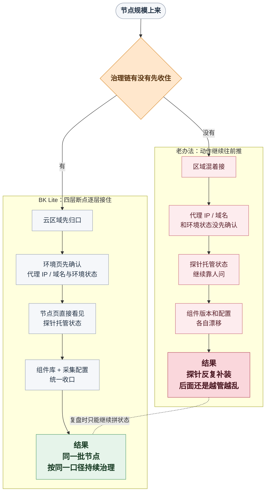

# 节点一多，探针为什么越来越难管

月末最后半小时，节点接入群里最刺耳的一句，不是“还有多少台没装”，而是：

> “这一批探针应该都装过了，可现在到底算不算接完了？”

主角是平台运维同学小周。那天是月末补装窗口收口前的最后半小时，他手里有一批刚扩出来的新节点，原本只想在群里确认一句：这批机器上的探针是不是已经补齐，明天晨会前能不能把接入结果交上去。

可他把群消息、节点列表和部署记录一对，事情一下就不对了。

- 有人说华东生产那批监控探针刚补完
- 有人说日志采集用的 Filebeat 上午已经处理过
- 还有人丢来一句“CMDB 那边要的采集探针应该也装了，先算接入吧”

三句话听起来都像在报进度，但说的根本不是同一类探针，更不是同一批节点上的同一轮接入结果。

表面看，动作都做过了。可真要把探针管理往下一接，现场立刻卡住。

<strong>哪些节点到底已经装上了探针，哪些只是跑过一次安装？</strong>

<strong>哪个区域的代理 IP / 域名已经配好，环境状态现在到底是不是通的？</strong>

<strong>同一类探针现在跑的是哪套版本，哪份配置已经真正在生效？</strong>

群里没人能把这三件事一口气讲完整。

问题就是从这里翻面的。因为大家接下来争的，已经不是<strong>“探针装没装”</strong>，而是<strong>“探针装完以后还能不能继续管下去”</strong>。

很多团队第一次真正意识到“探针越来越难管”，往往不是在安装失败的时候，而是在这种<strong>探针状态拼不起来</strong>的瞬间。

组件不一定没装，脚本也不一定没跑。

但只要你开始追问<strong>“哪些节点已经装上探针、哪个版本正在跑、哪份配置已经生效”</strong>，现场就会从安装问题迅速变成治理问题。

<!-- truncate -->

<div style={{ background: '#F5F5F5', borderLeft: '6px solid #D9D9D9', padding: '12px 16px', margin: '12px 0' }}><strong>真正把人卡住的，往往不是“装不上”，而是装上以后，没有一条能继续往下追的治理链。</strong></div>

复盘会上，小周后来补了一句很准的话：

> “我们看起来是在装组件，其实一直在拼状态。”

这篇文章想聊的，就是这句话背后那条断掉的链。

很多团队真正栽跟头的地方，恰恰就在这里：节点少的时候还能靠人扛，一到节点规模上来，探针部署就会从“装探针”滑成“管探针”。

## 病根：节点治理没成链

把锅甩给“安装步骤不够细”最省事，也最容易让人心安。

但很多现场真正缺的不是安装手册，而是节点、区域、探针、版本和配置根本没有沿同一条链被组织起来。

这背后的病根通常只有一句话：

> <strong>探针部署被当成了一串分散动作，而不是一条持续收口、持续确认、持续下发的治理链。</strong>

<div style={{ background: '#F5F5F5', borderLeft: '6px solid #D9D9D9', padding: '12px 16px', margin: '12px 0' }}><strong>动作可以一项项做完，治理链一旦断开，状态就还是会散。</strong></div>

这种断裂一到节点规模上来时，通常就会裂成四个连续断点：

| 卡点 | 小周眼前的表现 | 直接后果 |
| --- | --- | --- |
| 🌐 区域口径先乱了 | 同一批节点混着生产、测试和不同网络边界一起接 | 后续动作一开始就串不住 |
| 🔌 环境通信没先确认 | 探针准备下发了，区域环境状态却不稳 | 节点反复接不起来 |
| 🧭 探针托管状态不透明 | 有人说装过，但谁也说不清哪些节点真的在稳定跑 | 批量动作只能靠人核对 |
| 📦 版本与配置各自漂移 | 组件包和配置分散在不同人手里 | 同类节点跑的不是同一套东西 |

下面顺着小周这场现场往下拆，就更容易看清楚，为什么“探针明明装了”，部署还是会越来越乱。

## 为什么会越来越乱：四层连续断点

### 一、区域口径：节点还没装乱，边界先乱了

小周真正卡住的第一步，不是安装按钮点不下去，而是这批节点到底该先按什么口径收口。

同一批新接入节点，混着生产、测试和不同网络边界往里接，前期数量少的时候看不出问题，一到批量动作就会开始露馅。

他当时拉出来的节点列表，已经有点像这样：

```text
华东生产   8 台
华东测试   5 台
默认区域   7 台
未归类     4 台
```

这时候最容易出的问题，不是“装不上”，而是<strong>边界感先没了</strong>。哪些节点本来属于同一个区域，哪些机器压根不该走同一条部署口径，会慢慢一起变糊。后面的探针安装、组件下发和配置修改，都会开始<span style={{ color: '#B5475B' }}>互相污染</span>。

很多团队在这里的老办法是继续往前推：先把脚本跑了，后面再慢慢整理。可一旦这么干，后面的每一个动作都会建立在模糊边界上。

如果这一步没站稳，后面看起来是在装探针，实际上连“这些节点到底该不该走同一条接入链”都还没说清。

### 二、环境通信：脚本跑了，不等于探针就能稳下来

区域刚收完，小周马上会追第二个问题：这些节点现在开始铺探针，环境真的通了吗？

现场里最常见的误判，是把“脚本跑过了”当成“环境已经准备好了”。

可很多节点真正接不起来，不是安装动作本身错了，而是区域和平台之间的通信链根本没先打通。代理 IP / 域名、环境状态这一类基础通信条件如果没先确认，后面的探针下发、版本切换和配置更新都会<span style={{ color: '#B5475B' }}>反复出问题</span>。

到这里，现场表面上像是“这几个节点为什么老异常”，本质上却是更上游的一层没稳住。

```text
代理 IP / 域名   待确认
环境状态         异常
部署脚本         已生成未执行
```

更麻烦的是，很多团队并不是不知道环境重要，而是没有把它当成一个必须先确认的独立断点。于是脚本先跑，探针先铺，真正的通信状态反而被留到最后才回头核查。

这样一来，节点接不起来时，现场很容易陷入互相甩锅：有人怀疑脚本，有人怀疑网络，有人怀疑组件包，最后谁也说不清到底是哪一层先掉了链。

可就算环境补上了，现场也不会立刻轻松。因为小周下一步还得回答一句更难受的追问：到底哪些节点上的探针已经被真正托管住了？

### 三、探针托管：有人说装过，后面却越来越难管

就算区域和环境都过了一遍，小周回到节点侧时，最容易让现场重新变慢的，还是这句很普通的话：<strong>“哪些节点上的探针现在到底在不在稳定跑？”</strong>

一旦节点数量上来，探针是不是已经装好、当前跑着哪个版本、哪些节点在稳定采集、哪些节点其实已经掉了状态，如果还靠人翻表、翻群记录或者逐台确认，部署速度很快就会被人肉校对拖住。

探针部署到这里，看起来像安装任务，实际上已经变成了<strong>探针托管任务</strong>。

群里每多一句“这个我上午好像装过”，现场就会再慢一截。因为小周现在追的已经不是“有没有装过”，而是“装上去以后还在不在稳定跑”。

```text
node-17   Windows   探针未运行
node-18   Linux     版本未知
node-19   Linux     采集中
```

这一步真正把人拖住的，不是没有安装入口，而是没有一个稳定的探针托管视角。只要“哪些节点上的探针在跑、跑的是什么版本、状态是不是正常”还得靠人问、靠人翻、靠人对，后面的所有批量动作都会越来越慢。

可状态一旦看清，新的问题会立刻冒出来：就算这些节点都装上了，装的是不是同一套东西？

### 四、版本与配置：真正让现场越追越乱的后半程

探针托管状态能看见以后，小周下一步追的就不再只是“装没装”，而是“装的是不是同一套东西”。

当监控、日志、CMDB 需要的组件越来越多时，如果组件包还散在不同同学手里，部署动作就会慢慢退回到“谁手里有什么就先装什么”。短期看很有效，节点一多，版本口径马上开始<strong>分叉</strong>。

更麻烦的是，版本一分叉，配置也会跟着漂。改动一个采集规则，看起来只是改一行参数，真正落到现场时却会变成：一部分节点已经更新，一部分节点还在跑旧配置，最后谁在采、采什么、规则有没有生效，<span style={{ color: '#B5475B' }}>全靠人猜</span>。

也就是说，小周追到最后，面对的已经不是“有没有组件库”“有没有配置页”这种页面问题，而是<strong>探针版本和配置有没有沿着同一条路径持续下发</strong>。

很多现场真正乱掉，就是从这里开始的：前面三层已经够模糊了，最后一层再把“包从哪来、版本怎么控、配置谁吃到”拆散，整个节点纳管就会彻底滑成一堆零散动作。

这时候你会发现，现场真正缺的从来不是某一个按钮，而是一条完整的收口链：先确认边界，再确认通信，再确认接管，最后让版本和配置能按同一口径持续落下去。

## 如果要把这条链补起来，节点管理至少要具备什么

顺着前面四层往回看，其实就能倒推出一个结论：

如果你想让节点一多以后，探针部署别再越装越乱，节点管理至少得同时具备下面四种能力。

| 断点 | 现场真正缺的能力 |
| --- | --- |
| 区域口径先乱了 | 能先按区域、环境、网络边界把节点收口 |
| 环境通信没先确认 | 能先看通信链是否站稳，而不是脚本跑过就算数 |
| 探针托管状态不透明 | 能直接看见哪些节点上的探针在运行、当前版本是什么 |
| 版本与配置各自漂移 | 能把组件版本和配置下发放进同一条管理路径 |

换句话说，问题从来不是“要不要有一个装探针的地方”，而是要不要有一套能把<strong>边界、环境、探针托管、版本、配置</strong>串成同一条治理链的探针管理能力。

## BK Lite 怎么把探针管理接起来

这也是 BK Lite 节点管理真正切进来的地方。它不是先假设你已经把前面的治理都做好了，而是把这条容易断的探针管理链，拆成几段可以被逐步补齐的能力。

<strong>第一段是区域收口。</strong> 云区域本身就是节点资源的逻辑分组单元，可以按生产、测试或网络边界先把节点归口，让后面的动作先有边界。

<strong>第二段是环境通信确认。</strong> 环境页可以先填写代理 IP 或域名，生成部署脚本，再看环境状态到底是不是正常，先确认通信链有没有站稳。

<strong>第三段是探针托管状态可见。</strong> 到了 BK Lite 这一层，就应该把<strong>控制器</strong>讲清楚了：它就是节点侧承接探针托管的关键层。Linux、Windows 节点既可以远程安装，也可以手动安装；更关键的是，列表里能直接看到<strong>控制器状态、版本信息和托管组件状态</strong>。也就是说，控制器把“装上探针”往前推进成了“持续托管探针”，而对运维来说，更重要的是<strong>“探针是不是已经被稳定托管住了”终于能直接看见</strong>。

<strong>第四段是版本和配置统一收口。</strong> 组件库把<strong>监控、日志、CMDB</strong>等多类型组件统一放进同一个管理面，支持新增组件、上传包和版本管理；采集配置再拆成<strong>主配置和子配置</strong>，结合变量做动态替换，最后再由<strong>控制器</strong>把最终配置应用到目标节点。

<strong>前者解决“该装哪套包”，后者解决“装完以后到底吃到哪份配置”。</strong> 这两层一接上，探针部署才不再是“谁手里有包谁去装”，而是先有<span style={{ color: '#2F7D32' }}>统一的组件资源池</span>，再通过<strong>控制器</strong>沿着<strong>统一路径</strong>把版本和配置持续落下去。

## 把四层重新串起来：一次理想中的月末半小时

回到开头那场现场。如果当时小周面对的不是一堆分散动作，而是一条真正闭合的探针管理链，他的剧本会更接近下面这样：



这张图真正想说明的，不是“节点管理分四步”，而是“同样是接节点，治理链断开和治理链补齐，最后会走到<strong>完全不同的结果</strong>”。

小周熟悉的是前一种：节点明明接进来了，但越往后越要靠群聊、表格和口头确认补状态。

BK Lite 节点管理真正补的，是后一种：先把区域、环境、探针托管、组件和配置收成同一条链，后面的批量治理才不会一路散掉。

## 写在最后：节点管理的价值，不是“能装”，而是“能持续接住”

所以回到最开始那个问题，节点一多，探针为什么会越来越难管？很多时候卡住的不是某一次安装动作，而是探针管理一直停留在零散动作管理，没有变成一条从区域、环境、探针托管到版本配置的完整链。

这也是 BK Lite 节点管理更值得进入规模化运维链路的地方。

它提供的不是一个孤立的“装探针页面”，而是一种能把节点和探针全生命周期重新组织起来的管理方式。哪怕你现在还没用过 BK Lite，前面那四层断点依然会先真实存在；而 BK Lite 做的，是把这四层从“只能靠人扛”变成“探针可以被持续托管、持续更新、持续看清”。

<div style={{ background: '#F5F5F5', borderLeft: '6px solid #D9D9D9', padding: '12px 16px', margin: '12px 0' }}><strong>节点规模上来以后，真正决定现场会不会乱的，从来不是“这次装没装成功”，而是“装完以后，这条治理链还能不能继续往下追”。</strong></div>