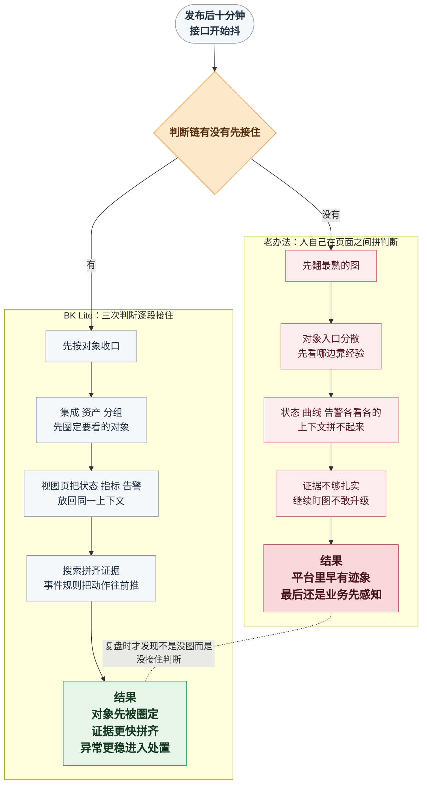

# 监控页面越来越多，值班时为什么还是看不清问题

最折磨值班同学的，很多时候不是完全没线索，而是线索其实已经陆续冒出来了，现场还是下不了判断。

<strong>真正把人拖住的，往往不是“看不见”，而是“已经看见了一些信号，却还是不知道该先判断什么”。</strong>

发布后十分钟，业务侧反馈首页接口开始抖。平台排障同学小李先被拉进故障群，前端说页面转圈明显变久了，后端同学怀疑是不是某台机器负载突然上来了，值班电话里又补了一句“刚才好像还有一条异常提醒闪过去”。听起来每个人都提供了一点信息，可这些信息放在一起，现场反而更难受：这次到底是主机先抖、服务先慢，还是某个依赖先出的问题？

线索并不算少，可真正难受的地方恰恰在这里：业务反馈、群消息、零散告警、临时翻出来的几张监控页看起来都能说明一点情况，但谁是先手，谁只是结果，这次到底该先接哪一层，还是说不清。

<strong>问题不在没有信号，而在信号出来了，判断却没有被顺手接住。</strong>

表面看，小李像是“已经看到了很多”。可只要继续往下追三句，现场就会立刻卡住：

<strong>这次到底先看哪类对象？</strong>

<strong>这些信号到底是不是同一件事？</strong>

<strong>现在是不是已经该升级处理了？</strong>

很多团队真正感受到“监控判断总慢半拍”，往往不是因为平台里没数据，而是因为这三次判断没有被顺手接住。

<!-- truncate -->

<strong>很多监控系统最大的问题，不是看不见，而是把“该怎么判断”这件事完整留给了人。</strong>

复盘会上，小李后来有一句话说得很准：

> “我们看起来是在翻线索，其实一直在拼判断。”

这篇文章想聊的，就是这句话背后那条总被拖慢的链。

## 病根：监控判断没成链

把问题归结成“图还不够多”，最省事，也最容易让人心安。

但很多现场真正缺的，不是再补一层大盘，也不是把值班同学换成一个更有经验的人，而是对象、信号、证据和动作根本没有沿同一条路径组织起来。

这背后的病根通常只有一句话：

> <strong>监控被做成了一堆分散可见的页面，而不是一条从看到信号到敢下判断的决策链。</strong>

<strong>图可以一张张补齐，判断链一旦断开，现场还是会慢。</strong>

这种断裂一到值班现场里，通常就会裂成三个连续断点：

| 卡点 | 小李眼前的表现 | 直接后果 |
| --- | --- | --- |
| 🧭 对象入口先乱了 | 主机、数据库、网络、中间件都能看，但不知道先接哪一层 | 排查从第一步就开始绕远 |
| 🔍 信号上下文没接住 | 状态、曲线、告警都能看到，但彼此像三条分开的线索 | 因果顺序和关联关系拼不起来 |
| 🚨 动作判断迟迟落不下去 | 已经看到异常，却还在犹豫要不要升级处置 | 现场继续观望，最后业务先感知 |

下面顺着小李这场现场往下拆，就更容易看清楚，为什么“监控明明做起来了”，判断还是会慢半拍。

## 为什么判断总慢半拍：三次连续断点

### 一、对象入口：先翻最熟的图，往往就已经慢了

小李真正卡住的第一下，不是某张图打不开，而是这次抖动到底该先看主机、数据库、中间件，还是网络对象。

这一步表面上只是入口选择，实际上最影响时间。因为只要对象入口还是散的，值班同学第一反应就只能靠经验挑方向。方向挑偏了，后面再努力，也是在错的入口里绕圈。

很多团队在这里的老办法，是先翻自己最熟的那几张大盘。这种办法在对象少时还能撑，一旦主机、网站、Ping、数据库、中间件都逐步接进来了，就会越来越不稳。每个人熟的都不是同一套，最后现场先发生的不是排障，而是“这次先看哪边”。

如果这一步没站稳，后面看起来是在分析指标，实际上连“这次到底该接哪类对象”都还没说清。

### 二、信号上下文：看到了很多线索，还是拼不成一件事

就算对象方向没有挑偏，现场也不会立刻轻松。因为值班同学接下来要面对的，从来不是一条单独信号，而是一组彼此同时在动的线索。

资源列表里能看到异常对象，实例详情里能看到指标趋势，告警页里也有新告警。难点不是没有图，而是这些东西默认并不会自己告诉你：这次是不是同一件事，哪条是最早抬头的，哪条只是后果。

如果这一层还要靠人手工切页面、记时间、做对照，排查就会很快退回成经验活。你能看到状态，能看到曲线，也能看到告警，但它们之间缺一段顺手的接力，于是一个本来应该几分钟内看实的实例，最后会被拖成几轮跳转和确认。

更麻烦的是，很多时候单实例已经看实了，结论还是下不来。因为更难的一问其实是：这些变化到底是单点波动，还是一组相关信号在一起失真？

### 三、动作判断：最慢的一步，往往不是看见，而是不敢升级

监控现场最容易被忽略的一件事，是值班同学最后总要做一个动作判断：现在是不是已经值得升级处理，还是继续观察。

这一步最怕的，不是没有数据，而是数据很多，证据却没有拼到足够扎实。CPU 在涨，数据库时延也在抖，某条告警刚挂出来，可如果这些信号不能放到同一时间轴里对照，你就很难确定这是单机离群、短时波动，还是已经该拉更多人介入的异常。

很多团队的监控为什么总慢业务半拍，问题就出在这里。平台里其实早就有迹象了，但因为联查路径没接上，值班同学迟迟不敢下结论，最后只能继续盯图，等业务先来报、等工单先升级、等外部压力先把决定逼出来。

走到这一步，现场真正缺的已经不是“再多看一张图”，而是有人能把对象、证据和动作顺着一条链接下去。

## 如果要把这条链补起来，监控中心至少要具备什么

顺着前面三个断点往回看，其实就能倒推出一个结论：

如果你想让监控判断别再总慢半拍，监控中心至少得同时具备下面三种能力。

| 断点 | 现场真正缺的能力 |
| --- | --- |
| 对象入口先乱了 | 能先按对象类型把采集模板、已接入资产和资源分组收稳 |
| 信号上下文没接住 | 能把异常对象、核心指标趋势和关联告警放回同一上下文 |
| 动作判断迟迟落不下去 | 能把跨指标证据拼起来，再把异常稳定推进到事件链路 |

换句话说，问题从来不是“要不要再加几个监控页面”，而是要不要有一套能把<strong>对象、信号、证据、动作</strong>串成同一条决策链的监控能力。

## BK Lite 怎么把这条判断链接起来

这也是 BK Lite 监控中心真正切进来的地方。它不是先假设你已经能把前面的判断都做顺了，而是把这条容易断的判断链，拆成几段可以被逐步接住的能力。

<strong>第一段是对象收口。</strong> 集成页按操作系统、网络、数据库、中间件提供采集模板，资产页继续承接已接入对象的状态与配置，分组能力再把散列资源按规则归类。这样做解决的不是“能不能采”，而是<strong>值班时能不能先把对象圈定，而不是从一堆入口里盲翻</strong>。

<strong>第二段是上下文接力。</strong> 视图页把全局资源列表、蜂巢视图、实例查看弹层和详情页接到一起。前者先把异常对象捞出来，后者再把核心指标趋势和关联告警放回同一个上下文里，让值班同学先把一个实例看实，而不是停留在“这台可能有问题”的模糊判断上。

<strong>第三段是证据拼接与动作推进。</strong> 搜索模块支持按“对象 -> 资产 -> 指标”链式构建查询，再结合维度过滤、多查询组、维度表和统一时间联动，把不同实例、不同指标甚至不同对象的信号摆到一起看。到了 BK Lite 这一层，更关键的是：事件模块继续把活跃告警、历史告警、策略配置和模板复用接起来。也就是说，前者解决“证据够不够”，后者解决“判断落下去以后，动作能不能继续往前推”。

## 把三次判断重新串起来：一次理想中的发布后十分钟

回到开头那场现场。如果当时小李面对的不是几块分散页面，而是一条真正闭合的判断链，他的剧本会更接近下面这样：

这张图真正想说明的，不是“监控中心有三块模块”，而是“同样是面对一次抖动现场，判断链断开和判断链补齐，最后会走到<strong>完全不同的结果</strong>”。

小李熟悉的是前一种：平台里其实早有信号，但对象、证据和动作都还要靠人自己一点点拼起来。

BK Lite 监控中心真正补的，是后一种：先把对象收住，再把上下文接住，再把证据和动作继续往前推，现场判断才不会一路拖慢。

## 写在最后：监控的价值，最后还是落在敢不敢判断

所以回到最开始那个问题，为什么很多团队监控数据已经很多了，现场判断还是慢半拍？很多时候卡住的不是某个指标不够，而是值班同学最关键的三次判断，依然要靠自己在不同页面之间拼起来。

这也是 BK Lite 监控中心更值得进入日常排障链路的地方。它提供的不是一个单纯的图表集合，而是一种把对象、证据和动作重新组织起来的方式。哪怕你现在还没用过 BK Lite，前面那三次判断依然会先真实存在；而 BK Lite 做的，是把这三次判断从“只能靠人硬扛”变成“系统可以持续接住”。

<strong>监控系统真正决定现场效率的，从来不是图表数量，而是值班同学能不能更早圈定对象、更快拼齐证据、更稳地把决定往前推进。</strong>
