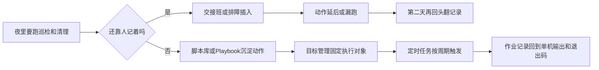

# 夜里该跑的巡检和清理，怎么总在交接班后断档？

月末第一天早上，运维群里最让人发紧的一句，不是“昨晚有没有告警”，而是：

> “那轮夜间巡检到底谁跑了？结果现在谁能说清楚？”

主角是平台运维同学老赵。前一晚交接班前，他还在群里补过一句：夜里记得跑一轮磁盘巡检，顺手把几台业务机上的旧日志清掉，再把几个关键服务状态过一遍。话刚发完，新的告警进来；临时排障一插进来，这轮原本人人都觉得“不难、等会儿就能做”的动作，就这么一路往后顺延。

到了第二天，真正让现场翻面的，不是命令没人会写，也不是脚本完全不存在，而是大家突然发现，谁都没法把昨晚那轮动作一口气讲完整。

<strong>到底是谁真正接过去跑了？</strong>

<strong>这次巡检和清理，昨晚到底打到了哪一批机器？</strong>

<strong>跑完以后，是正常结束了，还是中间已经有节点报错？</strong>

群里并不安静。有人说“这个我昨晚好像跑过”，也有人说“清理动作应该做了，只是没回结果”。可越是这种听起来都像做过一点的现场，越容易把人拖住。因为你会很快发现，大家争的已经不是<strong>“会不会做”</strong>，而是<strong>“这轮动作到底有没有被完整接住”</strong>。

很多团队第一次真正意识到服务器例行维护会失控，往往也不是在脚本写不出来的时候，而是在这种<strong>动作明明该做、结果却没人能确认</strong>的瞬间。

<!-- truncate -->

<strong>服务器例行维护最麻烦的地方，很多时候不是动作不会做，而是动作明明都知道，最后却没人能说清它有没有被完整执行。</strong>

复盘会上，老赵后来说了一句很准的话：

> “我们看起来是在跑巡检，其实一直在补昨晚那轮没接住的执行。”

这篇文章想聊的，就是这句复盘背后那套总在交接班后掉下去的维护执行方式。

## 病根：例行维护没有被真正收住

把问题归结成“值班同学不够细心”最省事，也最容易让人心安。

但很多现场真正缺的，不是再多写几段命令，也不是要求大家交接时再认真一点，而是巡检、清理、自检这些动作根本没有被放进同一套稳定执行方式里。

这背后的病根通常只有一句话：

> <strong>服务器例行维护被当成了一串零散动作，而不是一套从准备、执行到确认都能继续往下追的稳定执行方式。</strong>

<strong>动作可以一项项安排，但只要没有被真正收住，交接班以后照样会漏、会拖、会说不清。</strong>

很多团队提到服务器维护，第一反应会落在“脚本够不够”“命令写没写好”这种问题上。但如果把视角拉回日常现场，会发现断档常常不是从命令本身开始的，而是从更前面的几层松动开始的。

先松的是动作。巡检、清理、服务自检这些命令经常要用，却长期散在个人目录、聊天记录和旧工单里。内容改过几次，参数换过几轮，临场执行时就很难保证还是同一版口径。

再松的是对象。测试机、预发机、生产机混在一起时，如果目标还是靠值班同学临时圈 IP 或凭记忆选机器，动作本身就已经带上了偏差风险。服务器数量越多，这一步越依赖个人经验，结果就越不稳。

接着松的是时间。很多团队的夜间巡检和清理动作，并没有真正固化在周期里，而是落在“晚点跑一下”“等会儿补一下”这类口头约定上。只要还靠人手触发，它就一定会被告警、发布和交接班不断往后挤。

最后松的是结果。任务跑完以后，如果只能知道“好像执行过”，却看不到统一流水、单机输出和退出码，那么后续的补跑、回滚和复盘就会重新回到人工确认。

把这几层连起来看，服务器例行维护真正难的，从来不是写一段命令，而是怎么把动作、对象、时间和结果一起收住。

## 断档最常发生在四个地方

| 断点 | 现场表现 | 为什么会反复出问题 |
| --- | --- | --- |
| 🧩 动作没有沉淀 | 常用维护命令分散在不同地方 | 同类动作每次都像重新确认一遍 |
| 🎯 对象没有收住 | 临场圈 IP、靠记忆选机器 | 机器越多，偏差风险越大 |
| ⏱️ 时间没有固化 | 夜里该跑的动作一拖再拖 | 只要靠人点执行，就会被更紧急的事挤掉 |
| 🔍 结果没有落底 | 跑过以后还是看不清失败落点 | 下一轮排查和补跑只能重新靠人补洞 |

这张表里最关键的一点，是四个断点并不是独立存在的。动作没有沉淀，就很难保证每次执行口径一致；对象没有收住，就算脚本没问题也可能打错范围；时间没有固化，前面准备得再好也可能在交接班后直接断掉；结果没有落底，出了问题又只能回到人工追溯。

## BK Lite 作业管理补的，不只是执行入口

<strong>如果要把这些维护动作真正收住，作业管理承接的重点就不该只是“能不能把命令发出去”，而是能不能把前面那几层断点一起压实。</strong>

<strong>第一层，是先把要跑的动作沉淀下来。</strong> BK Lite 作业管理里的脚本库和 Playbook 库，解决的不是“页面里多存一份代码”，而是把经常要跑的巡检、清理和服务自检动作沉淀成可复用资产。后面再跑同类任务时，不必继续从聊天记录里翻旧版本，也不需要每次都临场改一份新命令。

<strong>第二层，是把“发给谁”说清楚，也把批量下发主机这件事做扎实。</strong> 目标管理支持按标签或 IP 列表组织目标，也兼容有 Agent 和无 Agent 两种纳管模式；而快速执行本身就支持把脚本直接批量下发到目标主机执行。它真正补上的，不是一个选择机器的交互动作，而是让“这类维护任务到底该发给谁、这次要批量打到哪些主机”变成一组稳定、可复用、可复查的对象集合，而不是每次临场圈机器。

<strong>第三层，是把时间固化下来。</strong> 定时任务可以把脚本库里的脚本，或从快速执行沉淀下来的动作，绑定到固定 Cron 周期上。这样一来，夜间巡检、日志清理、状态探测就不会继续停留在“今晚谁有空点一下执行”，而是进入稳定触发的节奏里。

<strong>第四层，是把结果追回来。</strong> 每次执行都会保留统一流水，并能在作业记录和详情里继续下钻到单机输出和退出码。维护动作真正需要的不是一句“任务跑过了”，而是能继续回答：哪台主机失败、失败卡在哪一步、这次要不要补跑、影响范围有没有扩大。

## 从靠人记着跑，到让平台稳定接住

这类问题最容易被误判成“团队不够细心”或者“执行习惯不够好”。但如果把视角放回工程现场，会发现光靠人更细心，并不能解决交接班、夜间值班和临时排障同时出现时的断档问题。

真正能把服务器例行维护拉稳的，是让维护动作不再只存在于某个人的记忆里，不再只靠某一班的人临场补一下，也不再在执行后只剩一句模糊的“好像跑过”。

BK Lite 作业管理更值得关注的地方，就在于它不只是给一个执行入口，而是把脚本库、Playbook 库、目标管理、快速执行、定时任务和作业记录放进同一套受控执行方式里。这样一来，团队依赖的就不再是某个值班同学那一刻有没有记得去跑，而是平台能不能持续把动作沉淀、对象收住、批量下发主机这件事做稳、时间固化、结果追回来。

服务器例行维护真正缺的，从来不是再多几段脚本，而是把这些脚本稳定地放进一套执行方式里。只要这套执行方式还是松的，动作就还会断在夜里、断在交接班后、断在那些大家最忙的时候。只要它被真正收住，服务器维护才有机会从“有人知道怎么做”，走到“系统会稳定地把它做好”。