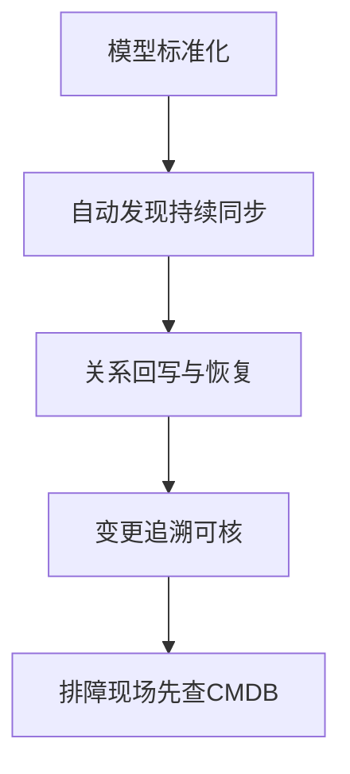

# CMDB 失真，往往不是录入问题

## 晨会前，最难回答的不是有没有资产

晨会前二十分钟，运维负责人被追问一件事：昨天那次抖动，到底是应用自己有问题，还是底层资源刚改过？

群里已经有人甩出了几张截图。有人说数据库实例前一晚做过调整，有人说服务其实早就迁过节点，还有人坚持配置没变。CMDB 里并不是没有这批资产，相关实例、关系和负责人也都能查到，但没有人愿意直接拿那份数据下结论。

让人头疼的，不是 CMDB 里查不到对象，而是查到了以后，没人敢保证它还是当前状态。信息开始过期以后，CMDB 会从排障入口退回成参考资料。

<!-- truncate -->

## 失真不是突然发生的

CMDB 很少会在某一天突然彻底失效。更常见的情况是，它先从一个小偏差开始。

一开始，字段还是能看懂的，只是偶尔有旧值没改。再往后，关系补写开始滞后，拓扑里出现“历史结构还在、线上结构已变”的分叉。到第三步，团队想追变更时发现线索不完整，只能回到群消息和人工确认。等到故障真的需要按依赖链定界时，CMDB 暴露出来的就不是“全错”，而是更难处理的“半真半假”。

| 失真阶段 | 现场表现 | 直接后果 |
| --- | --- | --- |
| 字段偏差 | 负责人、环境、状态偶发过期 | 查到对象但不敢直接判断 |
| 关系滞后 | 拓扑还在旧路径，线上已迁移 | 影响范围判断偏移 |
| 追溯断裂 | 变更时间线不完整 | 排障先找人再查库 |
| 信任下滑 | 团队默认二次核对 | CMDB 退化为参考台账 |

下面这条链路可以更直观看到失真是如何一步步放大的：

## 先松掉的，往往是模型标准

很多人把 CMDB 失真理解成关系图不准，这个判断没有错，但它通常不是第一层问题。更早出问题的，往往是模型标准本身没有立住。

同样一类资产，名称怎么写、状态怎么填、环境怎么标、负责人怎么挂，如果一开始就没有统一约束，后面录入的人越多，口径就会越散。有人按业务习惯填，有人按个人理解填，还有人为了图快把本该结构化的字段写成备注。到了后面，看起来大家都在维护一套资产，实际却在往同一个模型里塞进不同语义的数据。

BlueKing Lite CMDB 的模型管理，补的就是这层基础断点。模型分类、属性配置、字段分组和关系定义，不是页面装饰，而是对象标准。什么字段必须填，什么字段要唯一，哪些字段该用枚举，哪类对象之间允许建立什么关系，这些约束先稳定下来，后面的实例维护、全文检索和拓扑查看才有共同语义。

## 人工维护，天然追不上环境变化

就算模型标准做得不错，CMDB 也不会自动一直保持新鲜。让它越来越旧的，通常是环境变化速度远快于人工维护速度。

主机会调整，数据库会变更，网络设备会替换，云资源会扩缩，应用部署关系也会随着发布、迁移和治理动作不断变化。只要这些变化还主要依赖人工补录，CMDB 就迟早会落后。问题不在第一次录入，而在第二次、第三次、第四次变化发生以后，谁来把它们持续追回来。

BlueKing Lite CMDB 在这里给出的承接方式，是把自动发现接进来。它支持按对象类型配置采集任务，把主机、数据库、网络设备、云资源这类对象的变化持续带回 CMDB。更关键的是，任务结果会把新增、更新、删除、关联、异常分别列出来。

这件事的价值，不只是减少重复录入，更在于把变化重新纳入 CMDB。排障真正需要知道的，不是采集有没有跑，而是这次环境到底变了什么。

## 关系能不能信，取决于变化有没有写回

关系视图之所以经常失去说服力，是因为它最依赖持续更新。

一个服务昨天还运行在 A 节点，今天可能已经迁到 B 节点；一台数据库实例前一周还是某个业务的直接依赖，这一周可能已经被新链路替代。如果这些变化没有被及时带回 CMDB，拓扑图里展示的就不是当前依赖，而是上一次人工整理过的依赖。

关系恢复就在这里发挥作用。实例变了，部署位置变了，连接关系变了，如果库里仍然停留在旧结构，那么围绕它展开的影响分析一定会偏。

## 一线重新信任数据，靠的是可回溯

哪怕模型标准和自动发现都在做，如果团队还是不知道最近谁改过、改了什么、什么时候改的，信任也很难回来。

对排障现场来说，最有价值的信息往往不是有这条资产，而是这条资产最近有没有变。实例详情里的关联关系、拓扑视图和变更记录，解决的就是这个问题。谁修改了字段，前后值是什么，最近有没有自动发现写入，这条关系是不是刚刚调整过，这些信息能围绕同一个对象追出来，CMDB 才会重新成为现场的第一入口。

这一步的本质，是把资产数据从静态展示变成可追责、可回溯、可验证的配置底座。

## 上手前先问几句

在把 CMDB 当成排障入口之前，团队可以先回答下面四个问题：

1. 同类资产的字段口径是不是已经统一，关键字段是否有明确约束。
2. 自动发现任务是否在稳定运行，异常摘要是否有人持续跟进。
3. 关系变化能否被及时写回，拓扑是否反映当前部署结构。
4. 变更记录是否可追，是否能围绕一个对象串起最近的变化线索。

这四个问题里只要有两个回答不稳，CMDB 在故障现场就很难成为第一依据。

## CMDB 真正要补的，是后面的治理链

很多团队把 CMDB 的难点理解成资产录入，录入当然重要，但它只是开始。真正决定它会不会慢慢失效的，是后面那条治理链有没有闭合。

模型标准不稳，数据迟早会散；自动发现不接，台账迟早会旧；关系恢复和变更记录不完整，排障时大家迟早会绕开它。BlueKing Lite CMDB 的价值，不在于替团队再做一张更完整的表，而在于把这条从标准、同步到回溯的链条接起来。

对应到落地动作，可以把治理闭环理解成下面这条主路径：

回到开头那场晨会，团队最后需要的也不是“我们录过资产”这句解释，而是一份当前可用、变化可追、关系可核的数据底座。治理链一旦闭合，CMDB 才能重新站回排障入口的位置。
