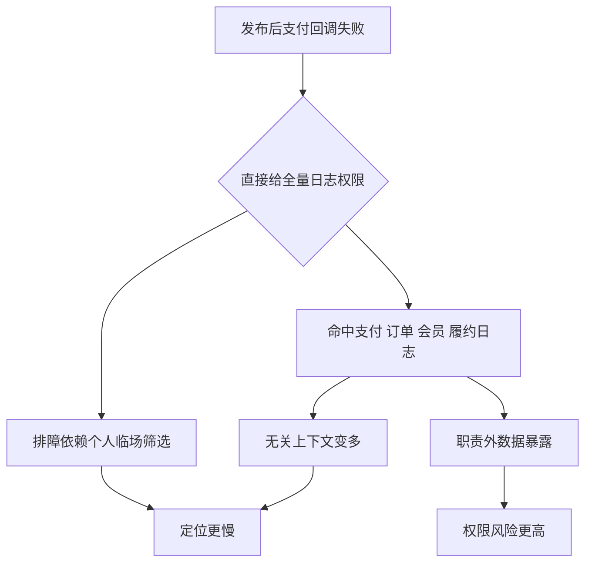
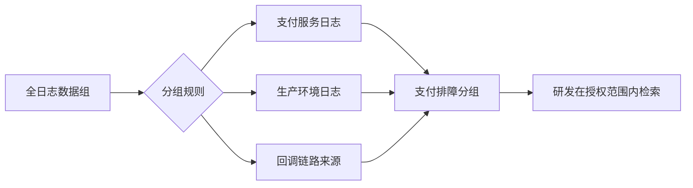

# 日志权限全量放开，排障更慢也更危险

## 发布后十分钟，日志权限先被要走

周三下午的例行发布刚结束，支付回调开始出现零星失败。业务接口人在群里追问影响范围，发布负责人把一条用户投诉里的请求 ID 发了出来，研发小周想马上进日志平台查上下文。

这时候运维还在确认一个问题：小周到底该看哪一批日志？

订单、会员、支付、履约几个服务都在同一条交易链路里，日志字段也有不少重叠。小周负责的是支付回调，但这次请求 ID 在多个系统里都会出现。如果只开放支付日志，担心线索不够；如果直接给全量检索权限，又可能把其他业务线的运行细节一起暴露出去。

群里很快有人给出最省事的建议：

> 先给全量检索权限，查完再收。

这句话听起来很务实。问题还没定位，大家都不想把时间耗在授权上。可小周真正进入全量入口以后，排障并没有变快。他搜同一个请求 ID，结果里同时出现支付回调、订单状态变更、会员权益校验和履约通知的日志。字段名相似，错误码相近，时间又都集中在同一分钟内。

他确实看到了更多日志，但也被更多无关日志拖住了。

更麻烦的是，其中几条会员侧日志里带着小周并不负责的业务参数。于是现场从“怎么尽快定位支付回调失败”，变成了两个问题一起压过来：权限是不是放大了，线索是不是也被放乱了。

这就是全量授权最容易被忽略的地方。它不只是“可能不合规”，也不只是“权限太大”。在真实排障里，它会同时造成数据越界和定位变慢。

<!-- truncate -->

## 真正缺的不是更大权限

回到小周的场景，他真正需要的并不是全站所有日志，而是能覆盖支付回调这次排障范围的搜索空间。

这个区别很关键。全量权限看似给了最大自由度，实际却把所有筛选责任都推给了排障人员。小周既要判断哪些日志属于支付回调，又要避开会员、订单、履约里的无关上下文，还要在一堆相似字段里拼查询条件。权限越大，搜索空间越脏，判断成本就越高。

很多团队把日志授权理解成“能不能看”，但排障现场真正要问的是“应该在哪个范围里看”。这个范围如果没有被提前定义，全量授权就会把三类问题一起放大。

| 现场后果 | 小周会遇到什么 | 更合理的治理对象 |
| --- | --- | --- |
| 数据越界 | 支付研发扫到会员、订单等职责外日志 | 按业务、环境、来源定义日志分组 |
| 定位变慢 | 请求 ID 命中太多无关链路，字段反复干扰判断 | 先把搜索范围收敛到相关分组 |
| 误判权限 | 查不到日志时继续加权限，实际可能是采集未生效 | 先确认采集对象和实例状态 |

这张表背后有一个判断：日志权限治理的核心，不是把权限开大一点，或者收紧一点，而是把搜索空间建模清楚。

排查支付回调失败，本来只需要聚焦支付服务、生产环境、相关采集源和对应时间段。范围一旦失控，研发会在大量相似日志里来回筛选；权限一旦越界，运维又要承担不必要的数据暴露风险。慢和危险看起来是两件事，根因其实都是搜索空间没有被定义。

## 第一层，先把支付日志圈出来

小周的第一步，不应该是进入全量日志入口，而应该是进入和职责匹配的日志分组。

BK Lite 日志中心的日志分组规则，承接的正是这件事。系统保留默认的全日志数据组作为兜底，同时允许新建分组条件。团队可以基于字段和值，通过“包含”“等于”等规则，把符合条件的日志归入自建分组。

放到这次支付回调排障里，运维可以先把支付服务相关日志、生产环境日志、回调链路对应来源收敛成一个明确分组。小周进入这个分组后，仍然能查请求 ID、错误码、上下游返回信息，但不会一上来扫到会员、订单、履约里所有相关或不相关的日志。

这一步看起来像配置，实质上是在定义协作边界。

- 支付团队进入支付相关分组，而不是默认进入全日志入口。
- 生产环境和测试环境分开，避免测试噪声混进故障判断。
- 文件日志、容器日志、不同业务来源按规则收敛，避免一次查询命中太多无关上下文。
- 授权动作落在分组和组织范围上，而不是落在临时口头判断上。

这样一来，运维不用在“不给会不会影响排障”和“给了会不会越界”之间反复摇摆。研发拿到的也不是被放大的全量入口，而是可以快速排障、同时边界清楚的日志范围。

下次同类问题再来，团队也不必重新讨论“要不要全量放开”，只需要确认该进入哪个分组。

## 第二层，别把采集问题误判成权限问题

现场继续往下走。小周进入支付日志分组后，搜到了部分错误日志，但有一台节点上的回调日志始终查不到。

这时候，群里很容易回到老思路：是不是权限还是不够？要不要再放大一点？

但查不到日志并不总是权限问题。采集路径可能写错，目标节点可能没有生效，接收实例可能状态异常，容器或文件日志也可能根本还没有进入检索链路。这个时候继续加权限，只会让排障方向偏掉，也会把刚刚收住的边界重新打散。

BK Lite 日志中心在接入侧支持 Syslog、File、Docker、Exec 等多类采集，也提供树形接收清单查看日志接收对象、实例和状态。这个视图的价值，是把“看不到日志”拆成更清楚的排查顺序：

1. 先确认这台节点的日志有没有采上来。
2. 再确认日志是否归入了支付相关分组。
3. 再看当前用户是否具备对应组织和分组权限。

对小周这类场景来说，这个顺序非常重要。因为“查不到”可能发生在采集、分组、授权任何一层。如果团队不先确认数据有没有进来，就会把采集问题误判成权限问题；如果不确认日志归属哪个分组，又可能把分组规则问题误判成用户权限问题。

权限治理最怕的不是收得太紧，而是把不同层的问题都用“再开大一点”处理。

## 第三层，把这次有效查法留下来

这次支付回调定位到一个下游返回码异常。小周用请求 ID 找到失败上下文，又根据错误码筛掉了部分无关日志。问题解决后，团队真正应该留下的，不只是“这次权限怎么给”，还包括“下次同类问题怎么查”。

很多日志排障效率低，不是因为权限少，而是每次都从空白查询框开始。接口超时查哪些字段，回调失败看哪个错误码，按请求 ID 追上下文时要避开哪些无关来源，这些动作如果全靠个人经验临场重拼，下一次还会重新浪费时间。

BK Lite 日志中心支持把时间戳、字段名、字段值追加到查询语句，也支持保存复杂查询条件并和所在组织绑定。也就是说，团队可以把这次经过验证的支付回调查法沉淀下来：

- 请求 ID 先在支付分组内查，而不是从全量入口查。
- 错误码和回调服务字段一起使用，避免命中无关链路。
- 时间范围先收窄到发布后异常窗口，再按需要扩大。
- 查询条件保存到所在组织，后续同类问题可以直接复用。

这一步解决的是另一个常被忽视的问题：控制权限边界，并不等于降低排障效率。真正有效的做法，是让研发在正确范围里更快查到相关日志，而不是让他在全量入口里靠经验筛。

到这里，日志协作才不再是“临时给权限，临时写查询，临时排故障”。它开始形成一条更稳定的链路：先确认数据可用，再定义可见范围，再沉淀高频查询。

## 从临时放权到可控协作

研发查线上日志不是问题。真正的问题，是把“临时方便”当成长期机制。

全量授权的诱惑在于它快，但它快得很粗。它绕过了日志来源、业务归属、组织权限和查询复用这些本该明确的边界。结果不是“权限更大，所以排障更快”，而是风险更大、噪声更多、判断更依赖个人经验。

BK Lite 日志中心更值得关注的地方，不是简单提供日志检索入口，而是把日志协作拆成几件可被平台承接的事：采集状态先可见，分组规则先收敛，组织权限先隔离，查询条件再沉淀。

回到开头那次支付回调排障，团队真正需要的不是把小周临时放进全量日志里，而是让他在支付相关范围内更快看到正确日志。这样研发仍然能快速定位问题，运维也不用每次在授权时凭经验冒险。

日志治理的目标不是让所有人看见全部日志，而是让正确的人在正确范围里，更快找到真正相关的那几行。
