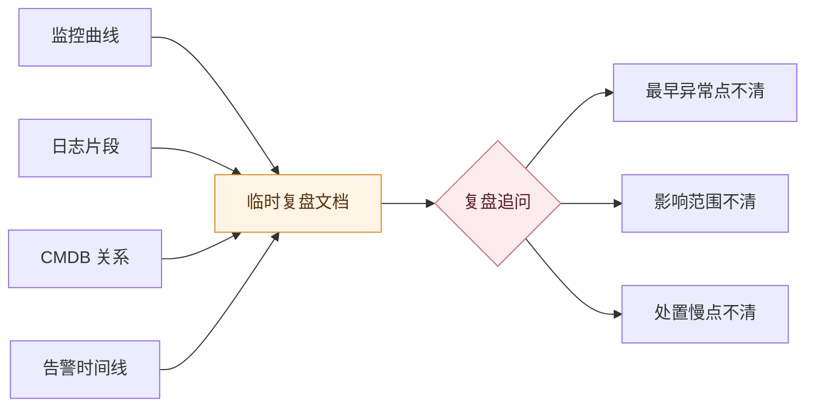
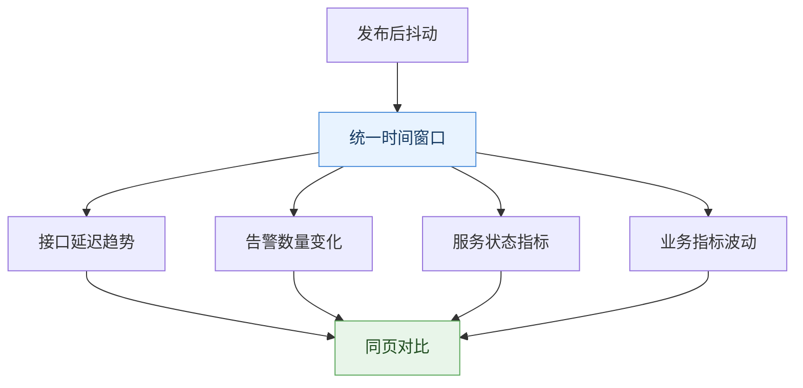
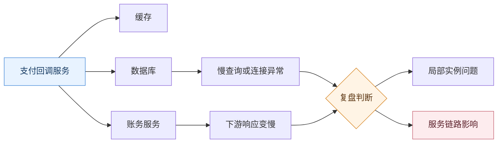
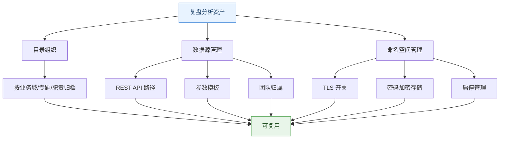

# 故障复盘为什么总拼不出现场

## 开场：晨会前那张拼不完整的图

晨会前 20 分钟，运维负责人小周被问住了。

昨天下午发布后，支付回调服务抖动了十几分钟。故障已经恢复，业务侧也确认交易补偿完成，但复盘材料迟迟拼不成一张完整图。

监控同学给了接口延迟曲线。

研发同学贴了几段带请求 ID 的错误日志。

CMDB 里能查到支付回调、缓存、数据库和下游账务服务的关系。

告警列表里也有触发、认领和恢复时间。

材料看起来很全。可复盘主持人追问了一句：

> “这次到底是哪个点先异常？影响范围是一个实例、一条服务链，还是整段支付链路？”

会议室安静了几秒。

不是没人有数据，而是每个人手里都只有一块碎片。小周能解释其中任意一张截图，却很难把这些截图串成一个连续现场。

这就是很多故障复盘最难受的地方：**证据都在，现场不在。**

<!-- truncate -->

## 病根：数据没有进入同一条判断链

排障时，分散系统还能靠人顶住。

小周可以先看监控曲线，再搜日志，再补查资产关系，最后翻告警记录。故障还没结束时，这种“多开几个页面”的方式虽然费劲，但至少能继续往前推。

复盘不一样。

复盘要回答的是一条完整判断链：

- 异常最早从哪里冒出来
- 哪些指标先变，哪些日志随后出现
- 影响范围到底落在哪些服务和资源上
- 处置动作为什么在某个时间点变慢
- 这次材料下次还能不能复用

如果这些答案分散在不同系统里，复盘就会退化成截图整理。大家都在证明“我这里有线索”，但没有一张图能告诉团队“这场故障是怎样一步步展开的”。

这张图不是说临时文档没用。它真正暴露的是：截图只能把证据堆在一起，不能自动建立证据之间的关系。

小周缺的不是第五张截图，而是一张可以复用的分析现场。

## 技术洞察：复盘不是材料归档，而是证据编排

复盘真正要沉淀的，不是“这次截图都放哪了”，而是三类能力：

- **时间对齐**：不同数据能不能回到同一个时间口径里
- **关系定位**：异常对象能不能和上下游依赖放在同一张结构里
- **资产复用**：这次分析能不能成为下次复盘、巡检或专题分析的入口

只要这三件事没有形成稳定资产，复盘就会一直靠人肉拼图。

BK Lite 运营分析的价值，也要放在这条链里理解。它不是替代监控、日志、CMDB 或告警，而是把这些分散线索放进同一分析空间，让一次临时分析有机会沉淀成可维护的分析资产。

## 一、时间对不齐

小周第一步卡在时间。

监控曲线显示 15:07 开始抖动，日志里第一条明显错误出现在 15:09，告警列表记录的触发时间又是 15:10。每个时间都对，但放在一起看时，大家仍然要反复确认：这些时间是不是同一个窗口？有没有截图截错范围？有没有人只截了恢复后的曲线？

这类卡点很常见。

复盘不是把几张图并排放出来，而是要让不同指标在同一个时间轴上互相解释。如果时间口径不一致，后面的影响范围判断和处置过程分析都会被拖慢。

### 用统一时间窗口接住第一轮证据

运营分析里的仪表盘适合承接这类“时间对齐”问题。

它支持折线图、柱状图、饼图、单值图，也支持全局时间选择器和公共过滤条件。对小周来说，这意味着告警趋势、服务状态、资源数量、业务指标可以放在同一页里观察，而不是每张截图各用各的时间范围。

这一步不负责直接给出根因。

它先把复盘从“各看各的图”拉回同一个时间窗口里。

图里最关键的不是“图表更多”，而是所有图表先回到同一个复盘口径。时间对齐以后，团队才有资格讨论“谁先变、谁后变”。

## 二、关系接不上

时间对齐以后，小周遇到第二个问题：影响范围说不清。

支付回调服务异常，日志里有数据库超时，监控里也能看到下游响应变慢。但这到底是支付服务自身抖动，还是下游账务服务拖慢，或者只是某个实例上的局部问题？

只靠指标很难回答。

指标能告诉你“变了”，但不能自然告诉你“和谁有关”。复盘会上，大家最容易在这里转向口头解释：这个服务依赖哪个库、哪个缓存、哪个下游接口，谁最近做过变更，哪个节点应该先看。

口头解释越多，复盘越难复用。

### 用拓扑图把异常对象和上下游放到同屏

运营分析里的拓扑图适合承接关系定位。

它支持图标节点、文本节点、单值节点、图表节点和连线，可以表达对象关系、依赖链路和节点状态。单值节点和图表节点还能绑定数据源，让拓扑图不只是静态结构，而是带上关键状态。

对小周来说，这张图要回答的不是“系统架构长什么样”，而是“这次异常沿着哪些对象发生了关联”。

这张图想压缩的是复盘里最费时间的一段口头解释：谁依赖谁，谁的状态异常，异常是否沿关系扩散。

当关系和状态放在同一张图里，影响范围才不再只靠“我记得应该是这样”。

## 三、结构留不住

小周把时间和关系都梳了一遍，复盘材料终于接近完整。

但另一个问题冒出来：这次图能不能留给下次用？

很多团队的架构图只活在一次复盘里。会后没人维护，下一次发布前也没人知道它是不是还可信。更糟的是，跨云资源、系统分层、变更前后结构这些信息，如果每次都临时重画，复盘就永远停在“重新解释背景”这一步。

复盘真正需要的不是一次性图纸，而是能长期维护的结构资产。

### 用架构图把复盘背景沉淀下来

运营分析里的架构图适合表达更静态的资源结构。

它可以承接系统架构展示、资源盘点、方案评审和变更前后的结构对比。相比拓扑图关注动态关系，架构图更适合把跨云资源分布、系统分层、平台组件和 CMDB 资源图标沉淀为可维护画布。

这让小周不必每次从零解释“这套系统大概长什么样”。

复盘时看的是故障现场，复盘后留下的是结构资产。

## 四、边界没人管

等小周准备把这套页面交给团队复用时，最后一层问题出现了。

谁能看？谁能改？数据从哪里来？哪些参数可以让使用者调整？跨环境数据接入是否安全？如果这些问题没有边界，复盘页很快会退回个人收藏，或者变成另一个没人敢维护的临时页面。

这一步看似不如前面几个问题紧急，但它决定了分析资产能不能活下去。

### 用目录、数据源和命名空间守住复用边界

运营分析通过目录树统一管理目录、仪表盘、拓扑图和架构图，支持按业务域、专题或职责范围组织分析资产。目录层级受到约束，能避免页面无限散开。

数据源管理负责定义 REST API 路径、参数模板、图表类型、数据源标签和团队归属。命名空间管理维护连接信息，支持 TLS 开关、密码加密存储和启停管理。

这些能力不是复盘结论本身，却是复盘资产长期可信的边界。

图里这几层不是装饰。目录、数据源、命名空间共同决定了复盘页能不能从“这次能用”变成“下次还能用”。

## 把几层串起来

回到小周那场复盘。

如果只有监控、日志、CMDB 和告警的零散截图，他只能不断解释每张图。可一旦这些线索被组织成分析资产，复盘路径会变得更清楚：

- 先用仪表盘把指标、告警和业务状态放到同一个时间口径下
- 再用拓扑图把异常对象和上下游关系放到同一张结构里
- 再用架构图沉淀长期结构，避免每次从零解释背景
- 最后用目录、数据源和命名空间把这套页面纳入可维护边界

这不是把根因分析自动化。

它解决的是根因分析之前那一步：让证据先站到同一张现场图里。

## 上手前先问几句

如果团队想把故障复盘从“材料包”推进到“分析资产”，可以先问自己几句：

| 问题 | 如果回答不上来，复盘会怎样 |
| --- | --- |
| 关键指标是否能用同一时间窗口查看 | 容易争论谁先异常、谁后异常 |
| 异常对象和上下游关系是否能同屏表达 | 影响范围只能靠口头解释 |
| 架构和资源结构是否能长期维护 | 每次复盘都要重新解释背景 |
| 数据源、参数和团队归属是否清楚 | 分析页容易退化成个人收藏 |
| 跨环境连接是否有安全边界 | 页面越沉淀，访问风险越难控 |

这些问题不复杂，却很容易被忽略。

复盘质量的差距，往往就出现在这些细节里。

## 结语

故障复盘拼不出现场，通常不是因为数据缺席。

真正缺的是把数据组织成现场的能力。

监控、日志、CMDB 和告警各自提供线索，BK Lite 运营分析要补的是线索之间的组织关系：用仪表盘对齐时间，用拓扑图表达影响范围，用架构图沉淀结构，用目录、数据源和命名空间治理保证分析资产可复用。

下一次复盘会开始时，团队要讨论的应该是问题为什么发生，而不是先确认“那张图到底从哪里截的”。
