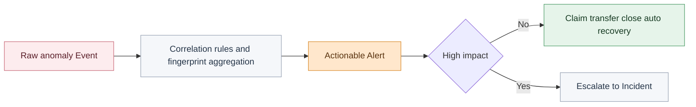
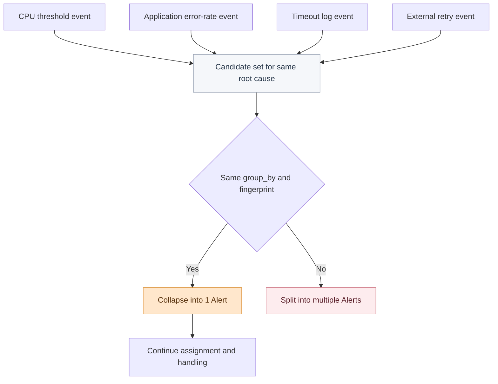
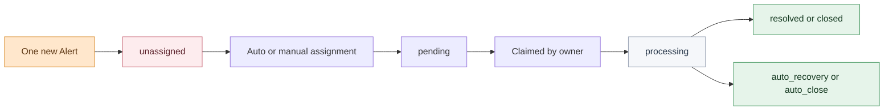

# When 10 Alerts Actually Mean 1 Problem: How to Govern Alert Noise Efficiently

Right after a release finishes, the alert list is already full of red states.

Host metrics are jittering, application error rates are rising, the log platform is surfacing anomalies, and the team channel is flooded with notifications from different sources within minutes. Lao Qian, the platform troubleshooter on duty, does not rush to claim alerts one by one. It is not because he is slow. It is because he knows the real danger in that moment is not that no one sees the problem. It is that **everyone gets dragged in different directions by 10 alerts that all look equally urgent**.

The hard part is rarely whether an anomaly has been detected.

The hard part is this: **out of these 10 alerts, which one is the real handling unit?**

<!-- truncate -->

<strong>Real alert governance is not about pushing more messages out. It is about collapsing one problem into a small number of objects worth acting on.</strong>

If the platform simply keeps forwarding abnormal signals from different sources, the frontline does not receive context. It receives fragments competing for attention. Every one of those 10 alerts looks important, and the result is that nobody wants to decide which one actually deserves priority.

That is why many teams think they are suffering from "too many alerts" when the real blocker is that the platform has not separated raw events from handling objects yet.

## The Root Cause: Lots of Messages, Very Few True Handling Units

Why can one fault explode into 10 alerts? The reasons are usually straightforward:

- Multiple metrics on the same resource cross thresholds at the same time.
- Upstream systems keep retrying before the issue is resolved.
- Flapping anomalies recur repeatedly in a short period.
- Different observability systems describe the same root cause from different angles.

On the surface, this looks like 10 anomalies happening at once.

At a deeper level, it is often just one problem surfacing repeatedly across multiple chains.

This is where the distortion begins. If the platform treats all raw signals as "alerts to be handled", the incident view becomes misleading immediately. A large quantity of signals does not mean a large quantity of problems. Loud alerts do not automatically deserve ownership.

<strong>The frontline is not most afraid of large alert volume. It is most afraid that “many raw events” and “very few real handling objects” were never separated in advance.</strong>

That is why several objects in the alert center that look similar on the surface must actually be kept distinct:

- Event carries the raw signal.
- Alert carries the unit that enters the handling workflow.
- Incident carries the problem that has escalated into higher-impact coordination.

Only when those three layers are separated does the platform stop throwing every red dot back at humans to interpret manually.

## Technical Insight: Three Objects, Three Responsibilities

One of the most common mistakes in alert governance is treating Event, Alert, and Incident as three names for the same thing.

They are not. They answer three very different questions:

- Event: what happened?
- Alert: what should be handled now?
- Incident: has this already escalated to a higher-impact problem?

If those layers are not separated, what reaches the frontline is not a unit that can be claimed, transferred, recovered, and closed. It is a pile of raw signals that still needs human interpretation.

The point of this diagram is not that the platform has more object types. The point is that **handling units must be layered**.

What Lao Qian needs is not more events. He needs the one problem object that has already been refined into an Alert. Only then can claiming, assignment, closure, and recovery happen on top of something stable.

## Why It Keeps Getting Louder and More Confusing: Three Layers Failed To Connect

Go back to the alert storm right after the release. Lao Qian hesitates not because the platform did nothing, but because if any one of the following three layers fails, the list becomes distorted immediately.

### 1. Event Convergence

The first way a single root cause drags the scene into chaos is when raw events are never converged first.

Multiple event sources are not the real problem. The real problem is that the platform has not helped decide which signals should already be considered the same issue. Host metrics, application errors, log anomalies, and external callback failures can appear at the same moment, but they should not automatically become four parallel work items.

#### Why It Explodes

The purpose of correlation rules is simple: decide which events should remain separate and which should first be grouped into a single problem object.

The documented capability boundaries are clear:

- Correlation rules define matching conditions.
- `group_by` defines aggregation dimensions.
- Fingerprints deduplicate repeated manifestations of the same problem.
- Sliding, fixed, and session windows define how long things count as one issue.
- Observation periods filter short flaps before they become formal alerts.

If this layer is missing, Lao Qian no longer sees "the problem". He sees fragments of the problem.

#### How BK Lite Converges Them

BK Lite Alert Center provides a full convergence chain rather than a one-off dedup trick:

- Events enter the platform first as raw data.
- Intelligent noise-reduction rules perform matching and aggregation.
- `group_by` defines what counts as one handling object.
- Session windows and observation periods filter flapping signals that self-recover.
- Active alerts with the same fingerprint are updated instead of recreated.

<strong>The value of turning 10 into 1 is not that the list looks shorter. It is that the frontline can finally start from the right object.</strong>

But this only solves half the problem. One alert surviving does not mean someone will actually pick it up.

### 2. Responsibility Flow

Many teams reduce alert volume and then fall into the second trap: assuming the job is done because there are fewer red dots.

In reality, response is often delayed not because no one saw the alert, but because everyone saw it and no one knew who it belonged to. Lao Qian knows this pattern well: everyone in the group watches the same alert, but nobody clicks claim first because they are all waiting for "the right person" to appear.

#### Why Nobody Still Owns It

If an Alert does not have a clear state flow and ownership flow, then it is still just a compressed red dot. It is not yet a stable handling unit.

The documented boundary here is also clear:

- Alerts have a defined state machine: unassigned, pending, processing, resolved, closed, auto_recovery, auto_close.
- Manual assignment, claiming, transfer, and closure are supported.
- Automatic assignment and fallback assignment are supported.
- Routing can be configured by time range and field conditions.

This layer is not about who saw the problem first. It is about who actually catches it.

#### How BK Lite Makes It Catchable

BK Lite fills the responsibility gap between "seeing" and "starting to handle" much more completely:

- Alert lists can be filtered by severity, status, source, and "my alerts".
- Claim, transfer, and close actions can be performed directly from the list.
- Routing strategies can be configured by one-time, daily, weekly, or monthly active windows.
- Alerts that do not match a routing policy can still enter a fallback notification chain.

The value is direct. If an alert is merely converged but never enters a clear ownership loop, Lao Qian still ends up going back to the group chat and asking manually. Only after ownership is stabilized does MTTR have a real chance to drop.

But governance should not swing too far in the other direction either. Reducing the list is not the same as handling the problem correctly.

### 3. Governance Boundaries

The third common mistake in alert governance is treating "less" as automatically "better".

What Lao Qian needs is not a platform that becomes silent no matter what happens. He needs a platform that **lets the right alerts remain and keeps the wrong ones out**. Aggregation, observation, and shielding are valuable not because they make the numbers smaller, but because they separate real handling units from worthless noise.

#### What Should Be Stopped Earlier

The documented boundary here mainly appears in three places:

- When a shield policy hits, the event enters SHIELD state and does not continue down the chain.
- Recovery events can override creation events and drive automatic recovery.
- High-impact problems can be escalated into Incidents for broader coordination.

That means governance is not just "compression". It includes at least three different treatments:

- Pre-shield low-value or planned signals that need no action.
- Converge fragmented manifestations of the same issue.
- Escalate higher-impact problems into Incidents.

#### How BK Lite Draws the Boundary

BK Lite’s value here is not that the alert list becomes quieter. It is that the platform makes those boundaries explicit:

- Shield policies block maintenance-window noise and low-value reminders early.
- Auto recovery prevents stale alerts from hanging around after the issue has healed.
- Incidents carry problems that have already exceeded the scope of a single alert.
- Operation logs preserve all governance actions for later review.

<strong>Good alert governance is not about making the system as quiet as possible. It is about making the one alert that should remain clearer, more trustworthy, and harder to bury.</strong>

## What Was Really Compressed?

When you connect those three layers again, what the platform truly compresses is not just nine list items.

It compresses three slow human steps:

- figuring out which signals are actually the same problem,
- figuring out who should own the remaining alert,
- and figuring out whether that alert should even exist at all.

That is why the title’s claim that only one alert should really be handled does not mean the other nine were meaningless. It means most of them are echoes of the same problem from different systems and should not become nine separate work items.

## BK Lite’s Real Entry Point: Turning Problems Into Action Objects

Put the whole chain together and BK Lite Alert Center’s real value becomes clearer.

| Governance Stage | What Actually Blocks the Frontline | BK Lite Capability |
| --- | --- | --- |
| Raw anomalies enter the platform | Multiple sources are naturally repetitive | Multi-source intake, field normalization, Event ingestion |
| Similar events keep arriving | One root cause becomes many red dots | Correlation rules, fingerprint aggregation, `group_by`, windows, observation periods |
| An alert remains after convergence | It is visible, but no one owns it yet | State flow, claim, transfer, auto assignment, fallback notification |
| Governance boundary closes | Unclear what to shield and what to escalate | Shield policies, auto recovery, Incident escalation |
| Postmortem review | Teams want to know what the platform actually did | Related-event review, operation logs, notification trace |

The point of this table is not to repeat product features. It is to show that BK Lite is not trying to send more messages. It is trying to convert problems into action objects earlier.

## A Quick Self-Check

- Are you currently receiving many raw Events, or Alerts that have already been organized?
- Are multi-source anomalies from the same root cause being merged into one handling object through correlation rules and `group_by`?
- Can the remaining Alert enter a responsibility loop immediately through claim, transfer, closure, or auto recovery?
- Are shielding, observation, and Incident escalation truly helping the team separate what should be blocked from what should remain?

The first two questions determine whether noise can be contained. The last two determine whether the alert that remains can actually be handled well.

## Conclusion

Why should one fault often end up with just one alert that truly needs to be handled? Not because the other nine had no value, but because they were usually only echoes of the same problem across different systems.

At the end of the day, alert governance is not about the number of notifications. It is about whether the handling unit has been defined clearly. Events retain traceability. Alerts carry handling responsibility. Incidents carry higher-level coordination. Only when those three layers are separated can the frontline avoid drowning in simultaneous red dots.

What BK Lite Alert Center really adds is not "more notifications". It is the ability to converge, separate, and hand the right problem to the right person earlier. That is how 10 exploded alerts start to behave more like one problem that can actually be acted on.
