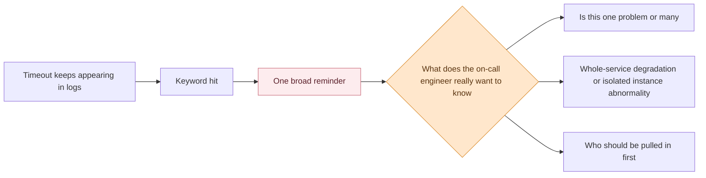
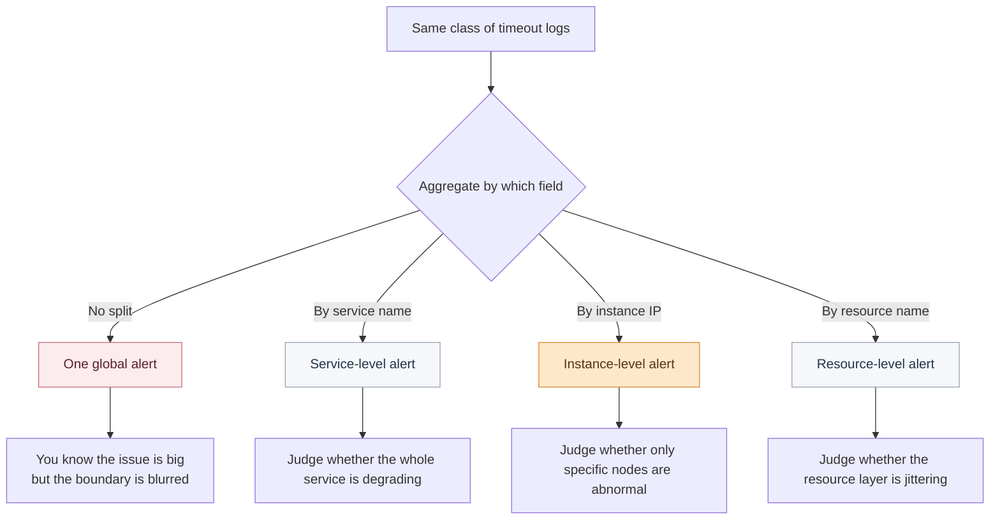
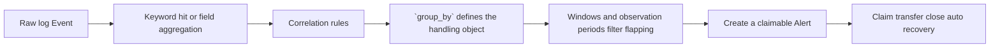

# When Log Alerts Keep Crying Wolf, Where Does the Problem Actually Start?

Right after a routine Wednesday release, the release channel starts filling up with timeout reminders.

The order service is logging errors. Payment callbacks are logging errors too. Several instances all show similar keywords. Lao Zhao, the release owner, opens the log center, searches for `timeout`, `Exception`, and `upstream reset`, and then goes back to the alert list.

The real problem is not that the page lacks information. It is that there is suddenly too much of it.

During the review, someone asks a painful question:

> Are these reminders describing the same problem, or are they already ten different handling objects?

The issue is not information scarcity. It is **too much information**. The same class of error keeps surfacing, alerts keep firing, and everyone in the group knows something is wrong, but no one can immediately answer the more important question: **is this one problem or ten?** Is the whole service degrading, or are only a few instances abnormal? Who should be pulled in first? Which layer should be checked first? Should the issue be escalated at all?

Many teams think logs overwhelm them with volume. In reality, what slows them down is that alerts never clearly define the **handling unit** at the very beginning. Keyword alerts and aggregation alerts can both work, but they answer different questions. The first captures the signal. The second draws the boundary of responsibility. If those two jobs are mixed together, the post-release troubleshooting scene quickly starts to feel like the boy who cried wolf.

<!-- truncate -->

<strong>What really causes hesitation is often not too many logs, but the fact that the system still has not handed over a clear answer to “which alert should we handle right now?”</strong>

## The Root Cause: The Abnormal Logs Were Seen, But the Alert Object Was Never Defined Clearly

Looking back at the incident, the most painful part is not that the system failed to make noise. It is that the system made noise and everyone still wanted to wait.

The root cause is usually simple:

> **The abnormal logs were visible, but the alert object had not been defined clearly yet.**

In a post-release troubleshooting scene, this mismatch usually shows up in three layers at once:

| Breakpoint | What It Looks Like | Direct Consequence |
| --- | --- | --- |
| Signal capture and object definition are mixed together | One broad keyword rule sweeps many anomalies into one bucket | The team knows something is wrong but not how many issues exist |
| Aggregation boundaries are unclear | The same timeout cannot be split clearly by instance, service, or resource | The team cannot tell local abnormality from service-wide degradation |
| Events never become real Alerts | The alert list keeps flashing but still has no stable responsibility boundary or lifecycle | Handling always falls back to manual judgment |

In other words, Lao Zhao is not really being slowed down by "too many logs". He is being slowed down because the system keeps shouting but never delivers a **stable problem object worth handling**.

## Why It Always Feels Like "Wolf!": Three Layers Never Connected

### 1. Keyword Alerts: Capture the Signal First, Not the Responsibility Boundary

Lao Zhao first finds a large wave of timeout logs in the log center.

That part is not hard. Search, grouping, query expressions, and histograms are already enough to determine whether anomalies are erupting in a short time window. Terminal mode is also good for watching the real-time stream continue to arrive.

The real problem is not "can we see the logs". It is **what happens after we see them**.

What truly determines troubleshooting efficiency from that point onward is whether the following questions can be separated quickly:

- Are these logs merely signaling the same type of risk, or are they already one concrete issue to handle?
- Is the same timeout affecting 12 instances together, or only one instance?
- Is Lao Zhao facing one broad alert that should be amplified, or several object-level alerts that should be owned independently?
- After these events enter the alert center, should they continue to be merged or remain split to preserve responsibility boundaries?

This is often where teams first realize that the real problem is not "too many alerts". It is that the alert object was never defined clearly.

The point of this diagram is not that keyword alerts are useless.

It is that **keyword alerts give you a signal, but not yet an object**.

At this layer, Lao Zhao hears a warning sound. What he really needs is a **handling unit**.

#### What This Layer Should Solve First

At the start of an incident, Lao Zhao usually depends on keyword alerts first, and that is reasonable.

At the earliest stage, the team’s first question is often very direct: has a dangerous signal appeared at all, and is it starting to recur continuously?

<strong>This layer should answer “is there a dangerous signal”, not yet “which problem object should we take over?”</strong>

At this layer, the log center is clearly useful:

- It supports fast anomaly location through search, grouping, and saved queries.
- It lets teams configure keyword alerts inside log event strategies.
- It can gather strong text patterns like database connection failure, fixed error codes, and downstream timeout into one unified entry point.

That is why keyword alerts often feel especially useful early in system adoption. They are good at capturing signals and telling the team something risky has started.

But the problem also starts here.

<strong>Keyword alerts act more like a unified warning. They shout the risk out loud, but they do not split the responsibility boundary for you.</strong>

#### Why They Cannot Define the Object For You

Keyword alerts are not meant to split responsibility boundaries down to the instance, service, or resource level.

If many services share one broad rule, Lao Zhao hears one loud alarm but still cannot tell how many real handling objects it represents.

At that point, he already knows something is wrong, but still does not know whether to pull more people in or isolate one instance for deeper inspection.

The signal was captured. The problem is that **the signal was mistaken for the object too early**.

## Technical Insight: What Must Remain Is a Trustworthy Alert

In those first few minutes after release, what Lao Zhao lacks is no longer more logs or louder reminders.

What he lacks is a problem object he can **trust, claim, and continue handling**.

The quality of log alerting is not defined by how many rules exist. It is defined by whether the final Alert left behind is actually believable.

- Signal capture: did a dangerous text pattern appear that deserves attention?
- Object definition: should these anomalies count as one problem or many, split by instance, service, or resource?
- Handling convergence: once events enter the alert center, which should continue to merge and which should preserve separate context for claiming, transferring, and recovery?

If a rule can only tell the team that "a lot of logs look suspicious lately", but cannot tell them which object to handle, who should handle it, or how to judge impact, then it creates hesitation rather than action.

That is why keyword alerts and aggregation alerts should never be treated as the same thing. They both create alerts from logs, but they land on different problems.

### 2. Aggregation Alerts: Define the Boundary Before You Talk About Noise Reduction

Since keyword alerts only answer whether the signal exists, the team quickly runs into the next question: should this wave of timeouts be treated as one problem or many?

This is where aggregation alerts become the real tool.

#### What Aggregation Is Actually Splitting

Aggregation alerts tell the system which fields should define the handling object.

The log center supports grouping by special fields so that different field values generate separate Alerts. The most common split dimensions are instance IP, service name, or resource name because those are the fields that define responsibility boundaries.

This is the part most teams describe vaguely. The question is not whether the system should alert again. The question is **how many handling objects the same anomaly wave should become**.

<strong>The real point of the second layer is not that “aggregation is more advanced”. It is that the same anomaly wave must be split along the right responsibility boundary.</strong>

If the same timeout appears on 12 instances and you still rely on one broad keyword alert, the only conclusion Lao Zhao gets is that there are many timeouts and the problem must be serious. But if aggregation is done by service name or instance IP, he can quickly tell whether this is full-service degradation or only a few bad nodes.

#### "Does It Exist" and "How Many Objects Is It" Cannot Be Mixed

Keyword alerts answer whether a dangerous signal exists.

Aggregation alerts answer how many handling objects that signal should become.

<strong>Once those two questions are mixed together, the on-call engineer hears only one loud alarm that is still very hard to take over.</strong>

This is where many teams misconfigure their rules. If they treat aggregation alerts as merely a stronger version of keyword alerts, they keep stuffing more keywords into one rule. If they expect keyword alerts to behave like aggregation alerts, they wrongly assume the responsibility split will happen automatically.

The result is always the same: logs keep making noise, but the alert object stays vague.

### 3. From Event to Alert: Turning Noise Into a Handling Object

Even after Lao Zhao has started to define clearer objects, the problem is not over.

The post-release scene is not really dealing with raw log lines anymore. It is dealing with units that can be claimed, transferred, traced, and recovered.

#### What Is the Difference Between Event and Alert?

This is exactly the transition the alert center takes over.

Events are raw anomaly data coming from external systems. Alerts are the handling objects formed after correlation rules aggregate related events.

To Lao Zhao, the difference is very direct: Event says **what happened**. Alert says **what should be handled now**.

<strong>The third layer is where “many raw events” are turned into “a small number of objects that can be claimed, routed, and recovered”.</strong>

#### What the Alert Center Really Converges

The alert center is not just another display layer. Through correlation rules, aggregation dimensions, window types, and observation periods, it converges repeated events into stable handling objects.

Three choices matter most here:

- which fields belong in `group_by`,
- how much time counts as one issue,
- and which short flaps should first be observed instead of amplified immediately.

If the boundary between keyword alerts and aggregation alerts was never made clear earlier, then the correlation rules that come later are just cleaning up confusion after the fact.

But once Events are stabilized into Alerts, the value of the alert center finally shows up. State flow shows whether a problem is unassigned, pending, processing, or resolved. Claiming and transfer move it into real responsibility flow. Related-event review preserves the raw context so the team can understand why the Alert was formed in the first place.

At that point, the team is no longer hearing endless cries of wolf. It is seeing a small number of problem objects that are actually worth moving into the handling flow.

## Put the Three Layers Together: Why Teams Still End Up Saying "Let's Wait"

If you replay the post-release troubleshooting path, the logic is clear:

- The log center surfaces the abnormal signal first and tells the team something is wrong.
- Aggregation alerts split similar anomalies by the right field and tell the team how many real issues exist.
- The alert center then converges Events into stable Alerts and tells the team who should handle them, how they should flow, and when they are recovered.

If any one of those layers is missing, the team falls back to the same old slow path: watch first, wait a bit longer, and reconstruct context manually.

That is why the real reason log alerting keeps feeling like "crying wolf" is not just volume. It is that the system never stabilized the reminder into an object the team was willing to trust.

## BK Lite’s Entry Point: Not Making Logs Louder, But Making Alerts More Trustworthy

Once you connect the layers, BK Lite’s real entry point in log alerting becomes much clearer.

| Troubleshooting Stage | What Actually Blocks the Team | BK Lite Capability |
| --- | --- | --- |
| First anomaly appears | You can see many timeouts but do not know whether they belong to one signal class | Log search, grouping, saved queries, keyword alerts |
| Need to split the object | It is unclear whether problems should be split by instance, service, or resource | Aggregation alerts in log event strategies |
| Need stable noise reduction | Similar events keep entering and it is unclear which should be merged | Correlation rules, `group_by`, window types, observation periods |
| Start handling | The anomaly needs to move to a specific owner rather than keep flashing in a list | Alert state flow, claim, transfer, close, auto recovery |
| Review afterwards | The team wants to know why the alert formed and why it recovered | Related-event review, event-alert context tracing |

The point of this table is not to list product features again. It is to explain a real governance chain. The log center is responsible for making anomalies visible. The alert center is responsible for turning them into objects that can actually be handled. The first solves "seeing". The second solves "trusting".

## A Quick Self-Check

- Are your current rules capturing dangerous signals, or are they already defining handling objects?
- Are similar anomalies split by instance, service, or resource instead of being dumped into one broad alert?
- Are `group_by`, evaluation windows, and observation periods in the alert center truly working for noise reduction?
- Once an alert is created, can the owner claim it, transfer it, and review context directly, or do they still have to return to raw logs?

The first two questions determine whether the anomaly is described clearly. The latter two determine whether it can truly be handled.

## Conclusion

At the end of the day, the quality of log alerting is not defined by how many rules exist. It is defined by whether every alert left behind is worthy of being trusted.

Keyword alerts are good for capturing strong signals. Aggregation alerts are good for defining the handling object by the right field. The alert center then stabilizes Events into Alerts that can be claimed, transferred, and recovered.

Only when those three steps connect into one chain do teams stop hesitating in front of alerts.

That is why the real problem with log alerting has never been just "too many alerts". It is that too many alerts were created without defining the handling unit correctly in the first place. Once that is corrected, the post-release troubleshooting scene stops sounding like endless cries of wolf and starts sounding like a few signals worth acting on immediately.
