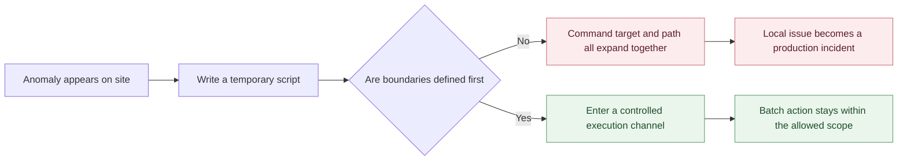
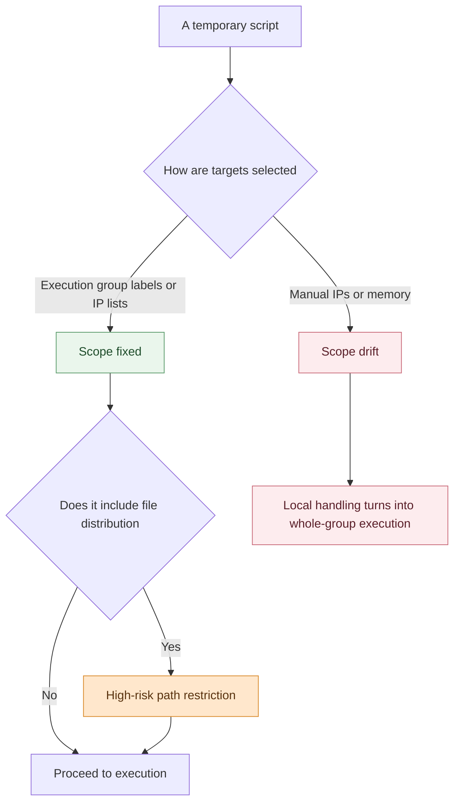

# When Running Scripts at Scale in Production, the Biggest Risk Often Isn't the Script

Twenty minutes before a month-end settlement window, disk usage on several nodes in the accounting cluster suddenly starts climbing. No one in the war room asks how the script should be written first. The first question is another one entirely: are we only touching a handful of abnormal nodes, or are we about to hit an entire execution group by accident?

What makes people tense is not whether to run a batch action at all. It is whether anyone can confidently say that this one click will land only where it is supposed to land. Script content, target scope, destination path, and post-execution traceability can all become failure amplifiers. In many production incidents caused by "automation gone wrong", the problem is not automation itself. The execution capability moves faster than the safety boundaries around it.

<!-- truncate -->

## The Root Cause Is Not the Script Itself

When teams review this kind of incident, the first reaction is often, "the script was wrong". That can happen, but the more common problem is different: batch execution is treated as simply "sending one command to many machines" without designing the controls that must exist before and after execution.

In high-pressure windows like month-end settlement, this usually breaks down in three ways at the same time:

| Failure Point | What It Looks Like On Site | Why It Gets Amplified |
| --- | --- | --- |
| Command boundary is not blocked | A temporary script contains destructive commands | The faster distribution becomes, the faster mistakes spread |
| Target boundary is not constrained | A few abnormal nodes are mistakenly expanded into a whole group | A local fix turns into a broad blast radius |
| Traceability boundary is not retained | You only see an overall success rate, not per-host output | Troubleshooting falls back to reconnecting to hosts manually |

What teams really worry about is not only whether the script is correct, but whether the action has been forced into a controlled execution path. That is the gap BK Lite Job Management is designed to close.

## First Boundary: Block Dangerous Actions Early

The first script written in that remediation session is a cleanup and diagnostic script. The hesitation is not about syntax. It is about whether any command inside it could cross the line immediately if the scope is wrong. In production, the riskiest actions are often not complicated. They are usually the shortest, easiest commands that are most likely to be copied into place under pressure.

That is why the most important first gate in job management is not the editor. It is the high-risk command detection and interception layer. Commands are checked against risk rules before they are submitted. The platform can block unsafe patterns through regex-based policies before execution starts rather than after damage has already been done.

Without this gate, batch execution itself becomes the amplifier. Under pressure, people naturally confuse speed with efficiency. In production, what matters more is stopping obviously unsafe commands at the starting point instead of trying to recover after dozens of hosts have already received them.

But whether a command may be sent is only half the boundary. In real incidents, an equally common failure is that the script lands on the wrong machines.

## Second Boundary: Draw the Right Target Scope First

As soon as target selection begins, the team’s attention shifts from "is the script ready" to "which hosts exactly are we touching". Test nodes and production nodes may differ only by a label. Within the same business pool, only a few machines may truly need intervention. Typing IPs by hand or relying on memory turns a production action into a bet.

Job Management turns this into a reusable execution group capability. Targets can be organized by labels or IP lists, and both agent and agentless management modes are supported. The most important value here is not convenience. It is that "who receives the command" stops being a one-time judgment call and becomes a target set that can be reviewed, reused, and accumulated safely over time.

The same is true for script libraries and Playbook libraries. Their value is not that they make the platform look feature-rich. Their real value is reducing drift caused by rebuilding scripts and scopes from scratch during every emergency. Once common actions and target sets are standardized, the number of variables left to decide under pressure drops sharply.

If file distribution is involved, this boundary must move one step earlier. Many incidents are not caused by the wrong command, but by files being delivered to the wrong path. BK Lite provides whitelist and blacklist controls for target paths. High-risk path rules keep critical system directories out of scope so that file delivery stays away from paths that can directly damage system stability.

By this point, the team has finally constrained both what is being sent and who it is being sent to. But there is still a third boundary that is often ignored: if the execution still fails, can you understand exactly where it started to go wrong without leaving the platform?

## Third Boundary: Preserve the Traceability Chain

The most frustrating part of batch execution is not failure itself. It is getting back only an abstract result. During a month-end window, the least useful message is often something like "overall success rate: 80%". That tells you almost nothing about which host failed first or whether the problem came from the command, the environment, or the selected scope.

Job Management generates a global execution trace for every run and allows operators to drill down into per-host output and exit codes from the job record and detail view. The value is not just interface completeness. It is that the starting point of troubleshooting is pulled back into the platform. Engineers do not need to reconnect to machines and inspect logs one by one before they even know where to start.

For production environments, this traceability chain is not optional. It is the closing mechanism that makes the first two boundaries meaningful. Only when teams can return directly to the per-host context can they confirm whether the batch action stayed within the expected scope.

## All Three Boundaries Need To Hold Together

When you walk back through the month-end scenario, it becomes clear why production batch execution so often fails at the boundary layer:

- Without command interception, risk crosses the line at the very beginning.
- Without execution groups and path restrictions, local remediation drifts into wider scope.
- Without job records and per-host output, troubleshooting falls back to manual reconnect-and-check workflows.

If any one of these three layers is missing, teams slide back into the most familiar and most dangerous pattern: send the script first and deal with the consequences later. The expensive part in production is exactly this kind of luck-driven execution.

What makes BK Lite Job Management worth attention is not how many hosts it can hit in a single run. It is that high-risk command rules, high-risk path restrictions, execution groups, script libraries, Playbook libraries, and job records are connected into one full chain. That means teams no longer depend on whether the on-call engineer happens to be cautious enough in the moment. They can rely on the platform to guard the boundaries before and after execution.

## Three Questions To Ask Before You Start

- Does this command contain anything that should be blocked by a high-risk command rule if the scope is wrong?
- Has the target scope already been fixed into an execution group, label set, or explicit IP list instead of being selected from memory on the spot?
- If the run fails, can the job details show per-host output and exit codes directly, or will the team still have to reconnect to machines manually?

These three questions map almost exactly to the three most common production amplifiers: unsafe commands being sent, the wrong target scope being selected, and failed actions becoming impossible to trace.

## What You Really Want Is Control

So why do batch scripts in production so often end up hurting the environment they were supposed to protect? Because the easiest thing to ignore is not the batch capability itself. It is the qualification check, the target check, and the traceability check behind the batch action.

In scenarios like this, the real goal is not "how many machines can one click hit". It is whether you can answer three questions consistently: why is this execution allowed, where exactly will it land, and where will you reconnect the problem if it fails? Only when those questions can be answered reliably does batch execution start to feel like real automation instead of a way to magnify human error in production.
