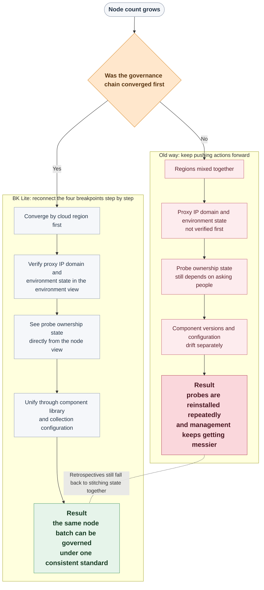

# Why Probe Management Gets Harder as Node Count Grows

In the last half hour before month-end cutoff, the most uncomfortable sentence in the node onboarding channel is usually not, "How many machines are still missing the probe?" It is this one:

> "We already installed probes on this batch, but does that actually mean the rollout is done?"

The main character here is Xiao Zhou, a platform operations engineer. That day, he was handling a batch of newly provisioned nodes just before the month-end installation window closed. His original goal was simple: confirm whether the probes on these machines had been completed so the team could report the onboarding result in the next morning’s meeting.

But once he compared the chat history, the node list, and the deployment records, the picture stopped lining up.

- Someone said the monitoring probes for the East China production batch had just been installed.
- Someone else said Filebeat for log collection had already been handled that morning.
- Another person dropped in with, "The CMDB collection probe should be installed too. Let’s count it as done first."

Each sentence sounded like a status update, but they were not talking about the same kind of probe, nor the same round of onboarding on the same batch of nodes.

On the surface, actions had already been taken. But the moment they tried to carry probe management one step further, the whole scene jammed.

<strong>Which nodes actually have the probe installed, and which ones only had an installer run once?</strong>

<strong>Which region already has the proxy IP or domain configured, and is the environment actually connected right now?</strong>

<strong>Which version of the probe is running on the same node type, and which configuration is truly in effect?</strong>

No one in the channel could answer all three questions cleanly in one pass.

That is where the discussion flips. What people are arguing about is no longer <strong>"was the probe installed or not"</strong>, but <strong>"after installation, can it still be managed as part of an ongoing process"</strong>.

Many teams realize that "probe management is getting harder" not when installation fails, but at the moment when <strong>the overall probe state can no longer be assembled into one coherent view</strong>.

The components may not be missing. The scripts may not have failed.

But the moment you start asking <strong>which nodes already have the probe, which version is running, and which configuration is active</strong>, the problem stops looking like an installation issue and starts looking like a governance issue.

<!-- truncate -->

<div style={{ background: '#F5F5F5', borderLeft: '6px solid #D9D9D9', padding: '12px 16px', margin: '12px 0' }}><strong>What really blocks teams is often not “it won’t install”, but that once it is installed, there is no governance chain left to keep following.</strong></div>

In the retrospective, Xiao Zhou later said something very precise:

> "It looked like we were installing components, but in reality we were just stitching status together by hand."

That broken chain is what this article is about.

The place where many teams really stumble is exactly here: when node volume is low, people can still hold the process together manually. Once scale grows, probe deployment stops being about "installing probes" and starts becoming about "governing probes".

## The Root Cause: Node Governance Never Became a Chain

Blaming the problem on "installation steps that are not detailed enough" is convenient, and psychologically comforting.

But in many real environments, what is missing is not another installation guide. The problem is that nodes, regions, probes, versions, and configuration were never organized along one continuous chain in the first place.

The root cause can usually be summarized in one sentence:

> <strong>Probe deployment is treated as a string of separate actions instead of a governance chain that continuously converges scope, verifies state, and pushes updates forward.</strong>

<div style={{ background: '#F5F5F5', borderLeft: '6px solid #D9D9D9', padding: '12px 16px', margin: '12px 0' }}><strong>You can complete actions one by one, but if the governance chain is broken, the overall state still scatters.</strong></div>

Once node scale starts growing, that break usually turns into four connected fracture points:

| Fracture Point | What Xiao Zhou Sees On Site | Direct Consequence |
| --- | --- | --- |
| 🌐 Region scope breaks first | One batch of nodes is onboarded across production, test, and multiple network boundaries at the same time | Every downstream action starts from a mixed scope |
| 🔌 Environment communication is not verified first | Probe rollout is ready, but the regional environment state is still unstable | Nodes repeatedly fail to connect |
| 🧭 Probe ownership state is opaque | People say probes were installed, but no one can clearly tell which nodes are actually running stably | Batch actions fall back to manual cross-checking |
| 📦 Version and configuration drift separately | Packages and configs are scattered across different owners | Similar nodes stop running the same setup |

If you walk through Xiao Zhou’s situation from there, it becomes much easier to see why "the probe was installed" still turns into an increasingly chaotic rollout.

## Why It Gets Messier: Four Connected Breakpoints

### 1. Region Scope: Before Installation Gets Messy, Boundaries Do

The first thing that blocks Xiao Zhou is not that the install button fails. It is that he cannot tell which boundary these nodes should belong to before anything else happens.

When a newly onboarded batch mixes production, test, and different network boundaries, the problem is easy to miss at small scale. Once batch actions start, the confusion becomes visible very quickly.

The node list he pulled up already looked something like this:

```text
East China Production   8 nodes
East China Test         5 nodes
Default Region          7 nodes
Unclassified            4 nodes
```

At that point, the biggest problem is not "installation failed". It is that <strong>the sense of boundary disappears first</strong>. Which nodes truly belong together, and which ones should never have followed the same deployment path, gradually blur into one pool. After that, probe installation, component rollout, and configuration changes start to <span style={{ color: '#B5475B' }}>pollute each other</span>.

The usual workaround is to keep pushing forward: run the script first and sort the structure out later. But once you do that, every downstream action is built on top of a blurry boundary.

If this first step never stabilizes, what looks like a probe rollout is still missing a more basic answer: should these nodes even belong to the same onboarding chain?

### 2. Environment Communication: Running the Script Does Not Mean the Probe Can Stabilize

Right after regions are grouped, Xiao Zhou immediately runs into the second question: if probes are about to be distributed to these nodes, is the environment actually connected?

The most common misjudgment on site is treating "the script has been run" as equivalent to "the environment is ready".

But many nodes fail to connect not because the installation step is wrong, but because the communication chain between the region and the platform was never opened first. If basic communication conditions such as the proxy IP, domain, and environment state are not confirmed ahead of time, then probe rollout, version switching, and config updates will all <span style={{ color: '#B5475B' }}>keep failing repeatedly</span>.

At that point, the surface symptom looks like "why do these nodes keep showing abnormal status", while the real issue is that an upstream layer was never stable.

```text
Proxy IP / Domain   To be confirmed
Environment State   Abnormal
Deployment Script   Generated but not executed
```

The more frustrating part is that many teams are not unaware of environment readiness. They simply do not treat it as an independent breakpoint that must be verified first. So the script runs first, the probe gets pushed first, and the actual communication state is only checked afterward.

That is how the scene turns into blame-shifting. Someone suspects the script. Someone suspects the network. Someone suspects the component package. In the end, nobody can explain which layer broke first.

And even if environment readiness is fixed, the scene does not immediately get easier. Xiao Zhou still has to answer a more painful question next: which nodes are actually under stable probe ownership now?

### 3. Probe Ownership: People Say It Was Installed, but It Keeps Getting Harder To Manage

Even after region and environment have both been checked, Xiao Zhou slows down again when he gets back to the node view and hears a very ordinary question: <strong>"Which nodes are actually running their probes steadily right now?"</strong>

Once node count rises, the real blocker is no longer whether the probe was installed at some point. It is whether you can clearly tell which nodes are running, which version is active, which nodes are collecting stably, and which ones have already drifted out of state. If all of that still depends on spreadsheets, chat history, or one-by-one confirmation, rollout speed gets dragged down by human reconciliation.

At this stage, what looks like an installation task has already become a <strong>probe ownership task</strong>.

Every extra sentence like "I think I installed that this morning" slows the scene down again. Xiao Zhou is no longer asking whether something was ever installed. He is asking whether it is still running steadily after installation.

```text
node-17   Windows   Probe not running
node-18   Linux     Version unknown
node-19   Linux     Collecting
```

What drags the team down here is not the lack of an install entry. It is the lack of a stable ownership view. As long as people still have to ask, search, and compare manually to know which nodes are running probes, which versions they run, and whether their state is healthy, every batch action gets slower.

And once the state finally becomes visible, another problem appears immediately: even if these nodes all have probes installed, are they actually running the same thing?

### 4. Version and Configuration: The Back Half Is Where the Scene Really Unravels

Once probe ownership state becomes visible, Xiao Zhou no longer asks only whether something is installed. He starts asking whether the same node class is running the same stack.

As monitoring, logging, and CMDB components continue to grow, any package that remains scattered across different people gradually pushes deployment back into a primitive pattern: everyone installs whatever package they happen to have. That may seem efficient in the short term, but as node count rises, version standards quickly <strong>split apart</strong>.

Worse, once versions diverge, configuration starts drifting too. A rule change may look like a one-line parameter update, but on site it becomes: some nodes already have the new configuration, some are still running the old one, and in the end who is collecting what, and whether the rule is active, becomes something people can only <span style={{ color: '#B5475B' }}>guess at</span>.

By that point, Xiao Zhou is no longer dealing with surface questions like "do we have a component library" or "do we have a config page". The real question is whether probe versions and configuration are being pushed continuously along the same path.

This is where many environments truly start to unravel. The first three layers are already blurry. Then the last layer splits package origin, version control, and config landing into separate tracks, and node onboarding collapses into a pile of isolated actions.

That is when the real gap becomes visible. What teams are missing is not one more button. It is one complete closing loop: confirm boundaries first, then communication, then ownership, and finally make sure versions and configs continue landing under one consistent standard.

## What Node Management Must Have To Reconnect This Chain

If you look back across those four layers, the conclusion is straightforward:

if you do not want probe deployment to become more chaotic as node count grows, node management must provide four capabilities at the same time.

| Breakpoint | Capability That Is Actually Missing |
| --- | --- |
| Region scope breaks first | The ability to converge nodes first by region, environment, and network boundary |
| Environment communication is not verified first | The ability to verify whether the communication chain is truly stable instead of assuming a run script means success |
| Probe ownership state is opaque | The ability to see directly which nodes are running the probe and which version is active |
| Version and configuration drift separately | The ability to put component versioning and config delivery into the same management path |

In other words, the real question is never whether there is "a place to install probes". The real question is whether there is a probe management capability that can string <strong>boundaries, environment, probe ownership, versioning, and configuration</strong> into one governance chain.

## How BK Lite Reconnects Probe Management

That is exactly where BK Lite Node Management enters. It does not assume those governance prerequisites are already solved. Instead, it breaks the fragile probe management chain into several parts that can be reconnected step by step.

<strong>The first part is regional convergence.</strong> Cloud regions act as the logical grouping unit for node resources. They let teams converge nodes first by production, test, or network boundary so that downstream actions begin with a clear scope.

<strong>The second part is environment communication verification.</strong> In the environment view, teams can fill in the proxy IP or domain, generate a deployment script, and then verify whether the environment state is truly healthy before deciding that the communication chain is ready.

<strong>The third part is visible probe ownership state.</strong> At this layer in BK Lite, the <strong>controller</strong> needs to be explained clearly: it is the key node-side layer that takes over ongoing probe ownership. Linux and Windows nodes can both be installed remotely or manually, but more importantly, the list view can show the <strong>controller state, version information, and hosted component state</strong> directly. In other words, the controller moves the problem from simply "installing a probe" to "continuously owning the probe", and for operations teams the more important shift is that <strong>whether a probe is actually under stable ownership finally becomes directly visible</strong>.

<strong>The fourth part is unified convergence of version and configuration.</strong> The component library puts multiple component types such as <strong>monitoring, logging, and CMDB</strong> into one management surface with package upload and version management. Collection configuration is then split into <strong>main configuration and sub-configuration</strong>, variables are used for dynamic substitution, and the <strong>controller</strong> applies the final configuration to target nodes.

<strong>The former answers “which package should be installed”, and the latter answers “which configuration is actually applied after installation”.</strong> Once those two layers are connected, probe deployment stops being a process where whoever holds a package installs it first. Instead, there is first a <span style={{ color: '#2F7D32' }}>unified component resource pool</span>, and then the <strong>controller</strong> continuously pushes version and configuration down along one <strong>unified path</strong>.

## Reconnecting the Four Layers: An Ideal Month-End Half Hour

Go back to the opening scene. If Xiao Zhou had been working with a closed probe management chain instead of a pile of disconnected actions, the script would have looked more like this:



What this diagram is really showing is not that "node management has four steps". It is that even when the work is still called node onboarding, a broken governance chain and a reconnected governance chain lead to <strong>completely different outcomes</strong>.

Xiao Zhou is familiar with the first path: nodes may have been connected, but every step afterward falls back to chat threads, spreadsheets, and verbal confirmation to reconstruct state.

What BK Lite Node Management really restores is the second path: regions, environment, probe ownership, components, and configuration are first pulled into one chain, so batch governance no longer falls apart downstream.

## Final Thought: The Value of Node Management Is Not That It Can Install, but That It Can Keep Holding the Chain

So back to the original question: why does probe management get harder as node count grows? In many cases, the blocker is not a failed installation action. The blocker is that probe management remains a set of isolated tasks instead of becoming one full chain from region and environment to probe ownership, versioning, and configuration.

That is also why BK Lite Node Management deserves a place in large-scale operations workflows.

What it provides is not one isolated "install probe" page. It provides a way to reorganize the full lifecycle of nodes and probes into one manageable structure. Even if you have never used BK Lite before, the four breakpoints described above still exist in the real world first. What BK Lite does is convert them from something teams can only carry manually into something probes can be continuously owned, continuously updated, and continuously understood through the platform.

<div style={{ background: '#F5F5F5', borderLeft: '6px solid #D9D9D9', padding: '12px 16px', margin: '12px 0' }}><strong>Once node scale increases, what determines whether the scene stays orderly is never just “did this installation succeed”. It is whether, after installation, the governance chain can still be followed all the way down.</strong></div>