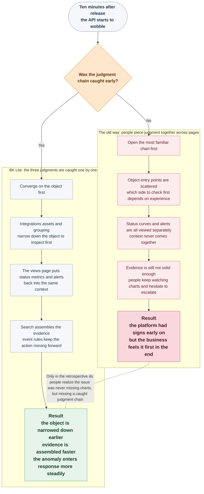

# Why Is It Still Hard to See the Problem Clearly Even as Monitoring Pages Keep Multiplying?

What wears on the on-call engineer most is often not a total lack of clues. It is that clues have already started to appear one after another, yet nobody can make a clear judgment on site.

<strong>What really slows people down is often not “we cannot see anything,” but “we have already seen some signals and still do not know what to judge first.”</strong>

Ten minutes after a release, the business side reports that the homepage API has started to wobble. Xiao Li, the platform troubleshooting engineer on call, is pulled into the incident chat. The frontend says the page spinner is obviously lasting longer. A backend engineer wonders whether one machine’s load suddenly spiked. Then someone on the duty phone adds, “I think an abnormal alert flashed by just now.” Each person seems to offer one piece of information, but when these fragments are put together, the scene becomes even more uncomfortable: did the host jitter first, did the service slow down first, or did a dependency fail first?

There are not exactly too few clues. That is the difficult part. Business feedback, chat messages, scattered alerts, and a few monitoring pages pulled up on the fly all seem to say something, but nobody can clearly tell which one came first, which one is only a consequence, or which layer should be checked first.

<strong>The problem is not that there are no signals. The problem is that the signals appear, but the judgment never gets picked up smoothly.</strong>

On the surface, Xiao Li looks like he has “already seen a lot.” But ask just three more questions, and the scene jams immediately:

<strong>Which type of object should we check first this time?</strong>

<strong>Do these signals really belong to the same incident?</strong>

<strong>Is it already time to escalate?</strong>

When teams feel that monitoring-based judgment is always one beat too slow, the root cause is often not missing data in the platform. It is that these three judgments were never caught in stride.

<!-- truncate -->

<strong>The biggest weakness in many monitoring systems is not that they fail to show signals, but that they leave the full burden of “how to judge” to people.</strong>

In the retrospective, Xiao Li later said something very precise:

> “It looked like we were browsing clues, but in reality we were piecing judgment together by hand.”

That is the slow chain this article wants to talk about.

## The Root Cause: Monitoring Judgment Never Became a Chain

It is easy, and emotionally comforting, to reduce the problem to “we still do not have enough charts.”

But in many real incidents, what is missing is not another dashboard, nor a more experienced on-call engineer. The real gap is that objects, signals, evidence, and actions were never organized along the same path.

The root cause usually comes down to one sentence:

> <strong>Monitoring was built as a collection of scattered pages that expose signals, not as a decision chain that carries people from seeing a signal to making a judgment with confidence.</strong>

<strong>You can keep adding charts one by one, but once the judgment chain is broken, the on-call scene still slows down.</strong>

In a real incident, that break usually turns into three connected fracture points:

| Fracture Point | What Xiao Li Sees On Site | Direct Consequence |
| --- | --- | --- |
| 🧭 The object entry point is already messy | Hosts, databases, networks, and middleware are all visible, but nobody knows which layer to enter first | The investigation starts by going the long way around |
| 🔍 Signal context never gets connected | Status, curves, and alerts are all visible, but they look like three separate clue lines | Cause-and-effect order and relationships never come together |
| 🚨 Action judgment never lands | The anomaly is already visible, but people still hesitate over whether to escalate | The team keeps watching, and the business feels it first |

Once you walk through Xiao Li’s incident in that order, it becomes much easier to see why teams can “already have monitoring in place” and still stay one beat too slow in judgment.

## Why Judgment Is Always One Beat Too Slow: Three Connected Breakpoints

### 1. Object Entry: Once You Start with the Most Familiar Chart, You Are Often Already Late

The first place where Xiao Li gets stuck is not that some chart fails to load. It is that he cannot tell whether this wobble should be checked first from the host side, the database side, the middleware side, or the network side.

On the surface, this only looks like an entry-point choice. In practice, it has an outsized impact on time. As long as object entry remains scattered, the first reaction of the on-call engineer can only be to choose a direction based on experience. If that direction is off, all further effort happens inside the wrong entry point.

The old workaround many teams use here is to open whichever dashboards they know best. That can still work when there are only a few object types. But once hosts, websites, Ping, databases, and middleware have all been connected gradually, this approach becomes increasingly unstable. Everyone is familiar with a different set of pages, and the first thing that happens on site is not troubleshooting but arguing over where to look first.

If this first step never stabilizes, what looks like metric analysis is still missing a more basic answer: which type of object should this incident even start from?

### 2. Signal Context: You Can See Many Clues and Still Fail to Assemble One Incident

Even if the object direction is not chosen wrong, the scene does not become easy right away. The on-call engineer is never facing one isolated signal. They are facing a set of clues that are moving at the same time.

The resource list may show abnormal objects. The instance detail page may show metric trends. The alert page may also contain new alerts. The difficulty is not the lack of charts. It is that these views do not automatically tell you whether they belong to the same incident, which signal rose first, and which one is only an aftereffect.

If this layer still depends on people switching pages manually, memorizing timestamps, and comparing them by hand, troubleshooting quickly falls back into an experience-driven craft. You can see status, curves, and alerts, but there is no smooth handoff between them. As a result, an instance that should have been verified within minutes gets dragged into several rounds of jumping and cross-checking.

What makes it worse is that even after one instance has been verified, the final judgment may still not land. The harder question is this: are these changes just a one-off fluctuation on one instance, or are they a related set of distorted signals moving together?

### 3. Action Judgment: The Slowest Step Is Often Not Seeing It, but Daring to Escalate

One of the easiest things to overlook in a monitoring incident is that the on-call engineer always has to make one final action judgment: is it time to escalate, or should we keep observing?

What makes this step difficult is not missing data. It is that there is plenty of data, while the evidence is still not assembled tightly enough. CPU is rising, database latency is wobbling, and a new alert has just appeared. But if these signals cannot be compared on the same timeline, it is hard to tell whether this is an outlier on one machine, a short-lived fluctuation, or an anomaly that already needs more people involved.

This is exactly why many teams’ monitoring still lags behind business impact. The platform often had early signs already. But because the investigation path never connected, the on-call engineer delays the conclusion, keeps staring at charts, waits for the business to complain first, waits for the ticket to escalate first, or waits for external pressure to force the decision.

At that point, what the scene lacks is no longer “one more chart.” What it lacks is a way to move objects, evidence, and actions forward along one connected path.

## What a Monitoring Center Must Have If It Wants to Reconnect This Chain

If you work backward from those three fracture points, one conclusion becomes clear.

If you want monitoring-based judgment to stop lagging by one beat, the monitoring center must have at least these three capabilities at the same time.

| Fracture Point | The Capability Actually Missing On Site |
| --- | --- |
| The object entry point is already messy | The ability to stabilize collection templates, onboarded assets, and resource grouping by object type first |
| Signal context never gets connected | The ability to place abnormal objects, core metric trends, and related alerts back into the same context |
| Action judgment never lands | The ability to piece together cross-metric evidence and then move a confirmed anomaly into the event handling chain |

In other words, the real question is never “should we add a few more monitoring pages?” It is whether there is a set of monitoring capabilities that can connect <strong>objects, signals, evidence, and actions</strong> into one decision chain.

## How BK Lite Reconnects This Judgment Chain

This is where BK Lite Monitoring really enters the picture. It does not assume that you have already made every judgment upstream in a smooth way. Instead, it breaks this easy-to-fracture judgment chain into several stages that can be caught progressively.

<strong>The first stage is object convergence.</strong> The integration page provides collection templates by operating system, network, database, and middleware. The asset page continues to carry the state and configuration of onboarded objects. Grouping then classifies scattered resources by rule. This does not just solve “can we collect data.” It solves <strong>whether the on-call engineer can narrow down the object first instead of blindly browsing through a pile of entry points</strong>.

<strong>The second stage is contextual handoff.</strong> The views page connects the global resource list, honeycomb view, instance popup, and detail page together. The first part helps surface abnormal objects. The second part places core metric trends and related alerts back into one shared context, so the on-call engineer can verify one instance concretely instead of staying at the vague stage of “this machine might have a problem.”

<strong>The third stage is evidence assembly and action progression.</strong> The search module supports chained queries in the order of “object -> asset -> metric.” Together with dimensional filtering, multi-query groups, dimension tables, and unified time linkage, it lets signals from different instances, metrics, and even objects be examined side by side. At the BK Lite level, what matters even more is that the event module keeps active alerts, historical alerts, policy configuration, and template reuse connected. In other words, the first part solves “is the evidence sufficient,” while the second part solves “once the judgment lands, can the action keep moving forward.”

## Reconnecting the Three Judgments: An Ideal Ten Minutes After Release

Let us return to the incident at the start. If Xiao Li had been facing not a few isolated pages but a truly closed judgment chain, his workflow would have looked closer to this:

What this diagram really wants to show is not that “the monitoring center has three modules.” It is that facing the same wobbling incident, a broken judgment chain and a reconnected judgment chain lead to <strong>completely different outcomes</strong>.

The first path is what Xiao Li already knows too well: the platform had signs early, but objects, evidence, and actions still had to be assembled by hand.

What BK Lite Monitoring really restores is the second path: first narrow down the object, then reconnect the context, then keep evidence and action moving forward so on-site judgment does not keep dragging behind.

## Final Note: The Value of Monitoring Still Lands on Whether You Can Make the Call

So back to the original question: why do many teams still stay one beat too slow in incident judgment even after they have accumulated a lot of monitoring data? In many cases, what blocks them is not that one metric is missing. It is that the three most important judgments still have to be pieced together manually across different pages.

That is also why BK Lite Monitoring deserves a place in the daily troubleshooting chain. What it provides is not just a collection of charts. It provides a way to reorganize objects, evidence, and actions. Even if you have never used BK Lite yet, those three judgments still exist in real life before the platform. What BK Lite does is turn them from something people must carry entirely by hand into something the system can keep catching for them.

<strong>What truly determines efficiency in a monitoring incident is never the number of charts, but whether the on-call engineer can narrow down the object earlier, assemble the evidence faster, and move the decision forward more steadily.</strong>
