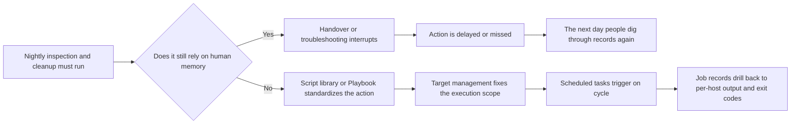

# Why Do Nightly Checks and Cleanup So Often Break After Shift Handover?

On the first morning of month-end, the most unsettling sentence in the operations channel is usually not, “Did anything alert last night?” It is this one:

> “Who actually ran that nightly inspection round, and who can clearly explain the result now?”

The main character here is Lao Zhao, a platform operations engineer. Before the handover the previous night, he had already posted a reminder in the chat: run one round of disk inspection overnight, clean old logs on several business servers, and check the status of a few critical services. Right after that, a new alert came in. Once an emergency troubleshooting task cut in, this round of work that everyone thought was “easy” and “something we can do in a moment” kept getting pushed back.

By the next day, what really turned the scene upside down was not that nobody knew how to write the commands, nor that the scripts did not exist at all. It was that suddenly nobody could explain the whole round of actions from start to finish in one pass.

<strong>Who actually took over and ran it?</strong>

<strong>Which batch of machines did last night’s inspection and cleanup really hit?</strong>

<strong>After it ran, did it finish normally, or had some nodes already failed in the middle?</strong>

The channel is not quiet. One person says, “I think I may have run that last night.” Another says, “The cleanup probably ran, we just never replied with the result.” But the more the scene sounds like everyone did part of it, the easier it is for the whole thing to drag on. Because very quickly, people stop arguing about <strong>“whether they know how to do it”</strong> and start arguing about <strong>“whether that round of work was actually carried through completely”</strong>.

Many teams first realize that routine server maintenance can spin out of control not when the script cannot be written, but at exactly this moment, when <strong>the action obviously should have happened and yet nobody can confirm the result</strong>.

<!-- truncate -->

<strong>The most troublesome part of routine server maintenance is often not that the actions are hard, but that everyone knows the actions and nobody can later explain whether they were fully executed.</strong>

In the retrospective, Lao Zhao later said something very accurate:

> “It looked like we were running inspections, but in reality we were filling in the execution that last night failed to hold together.”

That is the execution model behind this kind of retrospective, and that is what this article wants to talk about.

## The Root Cause: Routine Maintenance Was Never Truly Held Together

It is easy, and comforting, to reduce the problem to “the on-call engineer was not careful enough.”

But in many real environments, what is missing is not a few more commands, nor another reminder to be more careful during handover. The real issue is that inspection, cleanup, and service self-check actions were never placed into one stable execution model in the first place.

The root cause usually comes down to one sentence:

> <strong>Routine server maintenance is treated as a string of scattered actions instead of a stable execution model that can carry preparation, execution, and confirmation all the way through.</strong>

<strong>You can arrange actions one by one, but if they are never truly held together, shift handover will still make them leak, drag, and become impossible to explain.</strong>

When teams talk about server maintenance, the first reaction often lands on questions like “is the script good enough” or “was the command written well enough.” But if you pull the perspective back to the daily scene, you find that the gap rarely starts with the command itself. It starts when several earlier layers loosen first.

The first loose layer is the action itself. Inspections, cleanup, and service checks are needed all the time, yet they remain scattered across personal directories, chat history, and old tickets. After a few edits and a few rounds of parameter changes, it becomes hard to guarantee that the version being run on site is still the same one everyone thinks it is.

The next loose layer is the target. When test machines, staging machines, and production machines are mixed together, and the target still depends on the on-call engineer circling IPs on the spot or selecting machines from memory, the action already carries scope risk before it even starts. The more servers there are, the more this depends on individual experience, and the less stable the result becomes.

Then timing loosens. In many teams, nightly inspections and cleanup are never really fixed into a schedule. They live inside phrases like “run it a bit later” or “we’ll make it up in a while.” As long as a person still needs to trigger them manually, alerts, releases, and shift handovers will keep squeezing them backward.

The final loose layer is the result. If after a run you only know that it “seems to have executed,” but you cannot see a unified job record, per-host output, and exit codes, then reruns, rollback decisions, and retrospectives all fall back into manual confirmation.

Put these layers together, and it becomes obvious that the hard part of routine server maintenance was never writing one command. It was how to hold actions, targets, timing, and results together at the same time.

## The Break Most Often Happens In Four Places

| Breakpoint | What It Looks Like On Site | Why It Keeps Repeating |
| --- | --- | --- |
| 🧩 Actions are not standardized | Common maintenance commands are scattered in different places | The same kind of action feels like it must be re-confirmed every time |
| 🎯 Targets are not fixed | People circle IPs on the spot and pick machines from memory | The more machines there are, the greater the risk of drift |
| ⏱️ Timing is not solidified | Nightly actions keep getting delayed | As long as a person has to click run, something more urgent will push it out |
| 🔍 Results never land in a record | Even after the run, the failure point is still unclear | The next investigation and rerun fall back into manual patchwork |

The most important point in this table is that these four breakpoints do not exist independently. If actions are not standardized, you cannot keep execution consistent. If targets are not fixed, even a correct script can hit the wrong scope. If timing is not solidified, good preparation can still break apart after handover. If results do not land in a record, the moment something goes wrong, people fall back into manual tracing again.

## What BK Lite Job Management Repairs Is More Than an Execution Entry

<strong>If these maintenance actions are going to be truly held together, job management should not only answer “can we send the command out.” It has to compress those earlier breakpoints as well.</strong>

<strong>The first layer is to standardize the actions that need to be run.</strong> The script library and Playbook library in BK Lite Job Management do not solve the problem by simply storing one more copy of code in a page. They solve it by turning frequently used inspection, cleanup, and service-check actions into reusable assets. The next time a similar task needs to run, the team does not need to dig through chat history for an old version or rewrite a fresh command on the spot.

<strong>The second layer is to make “who receives it” explicit, and to make batch delivery to hosts stable.</strong> Target management supports organizing targets by labels or IP lists, and it supports both agent and agentless management modes. Quick execution itself can batch-deliver scripts directly to the target hosts. What this really repairs is not just the UI step of picking machines. It turns “which hosts should receive this maintenance action” into a stable, reusable, and reviewable target set instead of something rebuilt on the spot every time.

<strong>The third layer is to solidify the timing.</strong> Scheduled tasks can bind scripts from the script library, or actions沉淀 from quick execution, to a fixed Cron cycle. Once that happens, nightly inspections, log cleanup, and status checks stop living in the world of “whoever has time tonight can click run.” They move into a stable execution rhythm.

<strong>The fourth layer is to bring the results back.</strong> Every execution keeps a unified record, and job records and details can drill down into per-host output and exit codes. What maintenance really needs is not just the sentence “the task ran.” It needs to keep answering questions like: which host failed, where exactly did it fail, should this run be retried, and has the blast radius expanded?

## From Relying on Human Memory to Letting the Platform Hold It Steadily

This kind of problem is easy to misread as “the team is not careful enough” or “execution habits are not good enough.” But if you keep the perspective on the engineering scene, you quickly see that asking people to be more careful does not solve breakdowns that happen when handover, overnight duty, and emergency troubleshooting all appear at the same time.

What really stabilizes routine server maintenance is making sure that the action no longer lives only in one person’s memory, no longer depends on one shift temporarily making it up, and no longer leaves behind only a vague “it probably ran.”

That is where BK Lite Job Management becomes worth paying attention to. It is not just an execution entry. It puts the script library, Playbook library, target management, quick execution, scheduled tasks, and job records into one controlled execution model. At that point, the team no longer depends on whether one on-call engineer happens to remember to run the action. It depends on whether the platform can continuously standardize actions, hold targets steady, make batch delivery to hosts reliable, solidify timing, and bring the result back.

What routine server maintenance truly lacks is never a few more scripts. It is a stable way to place those scripts into execution. As long as that execution model stays loose, actions will keep breaking overnight, after handover, and at the exact moments when everyone is busiest. Once it is truly held together, server maintenance finally has a chance to move from “someone knows how to do it” to “the system can keep doing it steadily.”