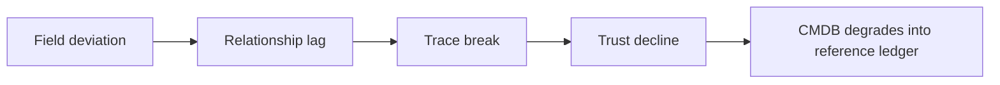
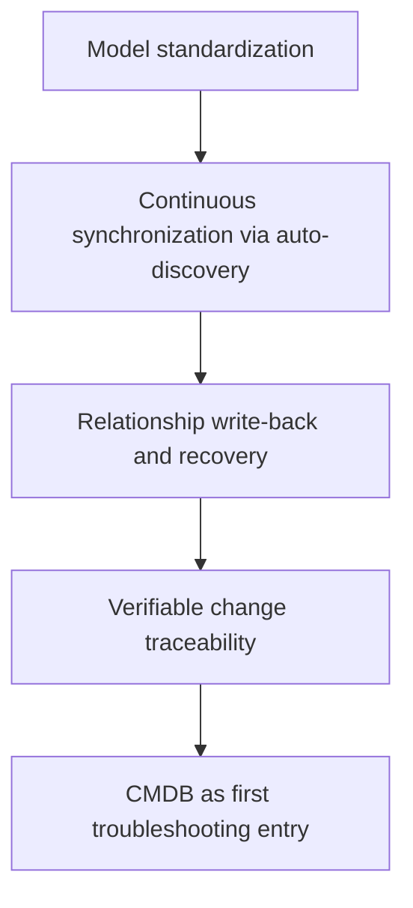

# CMDB Drift Is Often Not an Input Problem

## Before the Morning Standup, the Hardest Question Is Not Whether Assets Exist

Twenty minutes before the standup, the operations lead is asked one question: was yesterday's jitter caused by the application itself, or by a recent infrastructure change?

Screenshots are already flying in the chat. One person says a database instance was adjusted the night before. Another says the service had already migrated to different nodes. Someone else insists nothing changed. The CMDB is not empty. Related instances, relationships, and owners can all be found. But nobody is willing to make a direct call from that data.

The pain point is not failing to find objects in CMDB. The pain point is finding them and still not being sure they reflect the current state. Once data starts aging, CMDB slips from a troubleshooting entry back into reference material.

<!-- truncate -->

## Drift Rarely Happens All at Once

CMDB rarely fails completely on a single day. The more common pattern is a gradual slide that starts from a small deviation.

At first, fields are still understandable, with only occasional outdated values. Then relationship updates begin to lag, and topology starts to split into "historic structure still shown, online structure already changed." At the third stage, teams try to trace change history but find incomplete clues, so they fall back to chat history and manual confirmation. When an incident really needs dependency-based scoping, CMDB does not look entirely wrong. It looks worse: half true and half stale.

| Drift Stage | On-Site Symptom | Direct Consequence |
| --- | --- | --- |
| Field deviation | Owner, environment, and status are occasionally outdated | Objects can be found, but no one dares to conclude directly |
| Relationship lag | Topology still shows old paths while production has migrated | Impact scope is misjudged |
| Trace break | Change timeline is incomplete | Troubleshooting starts with asking people before querying CMDB |
| Trust decline | Teams default to double-checking | CMDB degrades into a reference ledger |

This chain shows how drift is amplified step by step:

## The First Layer That Loosens Is Usually Model Standards

Many people interpret CMDB drift as inaccurate relationship graphs. That is true, but usually not the first layer to fail. What often breaks earlier is model standardization.

For the same asset type, if naming, status, environment labeling, and ownership mapping are not constrained from the start, data semantics drift as more people maintain it. Some follow business habits, some use personal conventions, and some write structured values into free text for speed. It looks like everyone is maintaining one asset set, but in reality they are writing different semantics into the same model.

This is the breakpoint BlueKing Lite CMDB addresses at the model layer. Model categories, property definitions, field grouping, and relationship definitions are not UI decoration. They are object standards. Which fields are required, which must be unique, which should use enums, and which object types are allowed to relate, all of this must be stable first. Only then can instance maintenance, full-text search, and topology views share the same semantics.

## Manual Maintenance Cannot Keep Up with Environment Change

Even with good model standards, CMDB does not stay fresh by itself. The reason it ages is usually simple: environment change is faster than manual maintenance.

Hosts are adjusted. Databases change. Network devices are replaced. Cloud resources scale in and out. Application deployment relationships change continuously through release, migration, and governance actions. If these changes still rely mainly on manual updates, CMDB will eventually fall behind. The problem is not first-time input. The problem is who continuously catches up the second, third, and fourth wave of changes.

BlueKing Lite CMDB addresses this with auto-discovery. It supports object-type-based collection tasks to continuously bring host, database, network device, and cloud resource changes back into CMDB. More importantly, task results summarize additions, updates, deletions, associations, and anomalies separately.

The value is not only reduced repetitive input. The value is bringing change itself back under CMDB management. In troubleshooting, what matters is not whether collection ran, but what exactly changed in the environment.

## Whether Relationships Are Trustworthy Depends on Write-Back of Change

Relationship views lose credibility because they depend on continuous updates.

A service that ran on node A yesterday may run on node B today. A database instance that was a direct dependency for one business path last week may already be replaced this week. If those changes are not brought back in time, the topology shows not current dependencies, but the last manually curated view.

This is where relationship recovery matters. If instances, deployment locations, and connection relationships have changed but CMDB still shows old structure, then any impact analysis based on it will drift.

## Restoring Frontline Trust Requires Traceability

Even with model standards and auto-discovery, trust does not return if teams still cannot answer who changed what and when.

For troubleshooting, the most valuable information is often not that an asset exists, but whether it changed recently. Instance details that combine relationships, topology, and change records solve this exact gap. Who modified which field, what the before-and-after values were, whether auto-discovery wrote new updates, and whether a relationship was adjusted recently. Once these clues are traceable around the same object, CMDB can become the first entry point again.

In essence, this shifts asset data from static display to an accountable, traceable, and verifiable configuration foundation.

## Four Questions Before You Treat CMDB as the First Troubleshooting Entry

1. Are field semantics unified for the same asset type, and are key fields clearly constrained?
2. Are auto-discovery tasks running stably, and is anomaly summary continuously reviewed?
3. Can relationship changes be written back in time, and does topology reflect current deployment structure?
4. Are change records traceable, and can recent change clues be connected around one object?

If two of these four are unstable, CMDB is unlikely to become the first source of truth during incidents.

## What CMDB Must Really Fix Is the Governance Chain After Input

Many teams treat CMDB's main challenge as asset input. Input matters, but it is only the start. What determines whether CMDB slowly degrades is whether the governance chain behind it is closed.

If model standards are unstable, data drifts. If auto-discovery is missing, the ledger gets stale. If relationship recovery and change history are incomplete, teams will eventually route around CMDB during incidents. The value of BlueKing Lite CMDB is not providing one more complete table. It is connecting the full chain from standardization to synchronization to traceability.

A practical governance path looks like this:

Back to the standup scenario, what the team finally needs is not the statement "we already entered those assets." It needs a data foundation that is current, traceable, and relationship-verifiable. Once the governance chain is closed, CMDB can stand back at the troubleshooting entry where it belongs.
