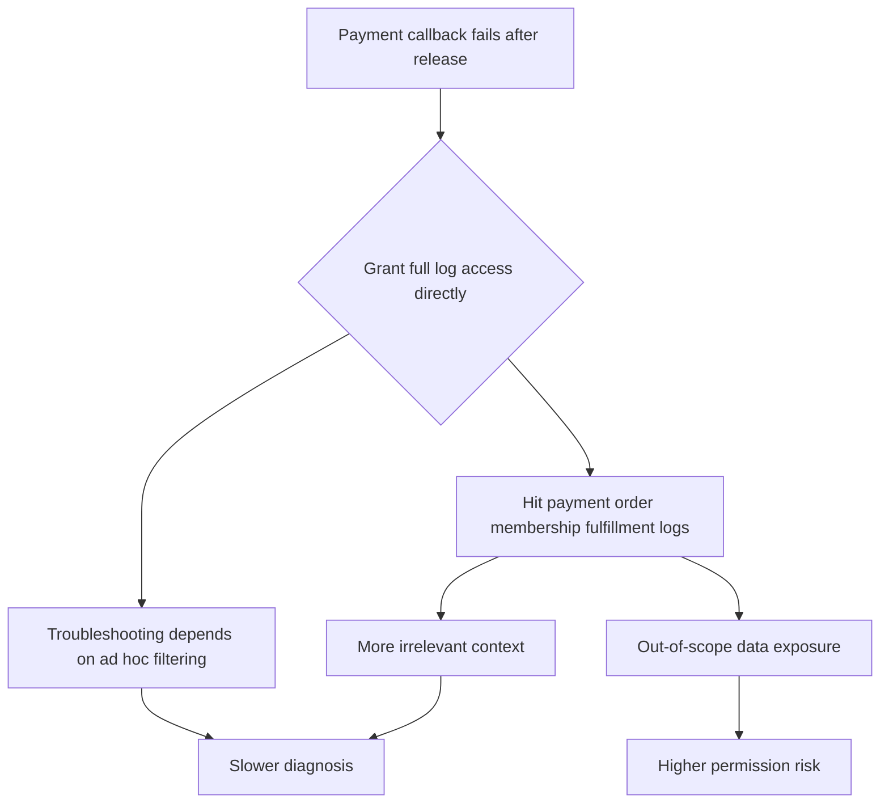
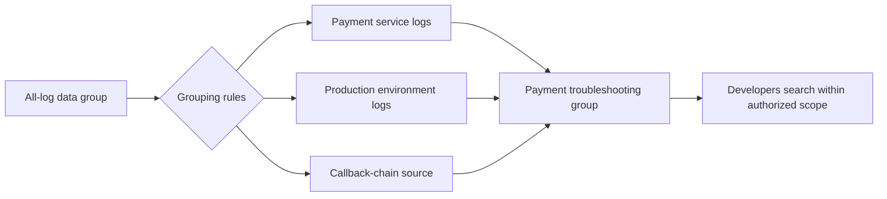
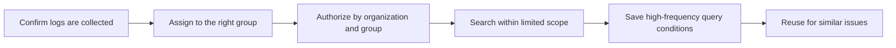

# Opening Full Log Access Makes Troubleshooting Slower and Riskier

## Ten Minutes After Release, Log Access Becomes the First Request

The regular Wednesday afternoon release has just finished when payment callbacks begin to fail sporadically. The business contact asks about impact scope in the group chat, and the release owner shares a request ID from a user complaint. Xiao Zhou, the developer responsible for payment callbacks, wants to jump into the log platform and inspect the context immediately.

Operations still needs to confirm one thing first: which logs should Xiao Zhou be allowed to see?

Order, membership, payment, and fulfillment services all sit on the same transaction path, and many log fields overlap. Xiao Zhou owns payment callbacks, but this request ID appears in multiple systems. If only payment logs are opened, clues may be missing. If full search access is granted directly, operational details from other business lines may be exposed too.

Someone quickly suggests the easiest path:

> Grant full search access first, then take it back after the issue is resolved.

It sounds practical. The issue is not yet located, and nobody wants to spend time on authorization. But once Xiao Zhou enters the full-search entry, troubleshooting does not get faster. Searching the same request ID returns payment callbacks, order status changes, membership entitlement checks, and fulfillment notifications. Field names look similar, error codes are close, and timestamps all cluster within the same minute.

He does see more logs, but he is also slowed down by more irrelevant logs.

Worse, several membership-side logs contain business parameters outside his responsibility. The scene shifts from "how do we locate the payment callback failure quickly" to two problems at once: whether permission scope was enlarged, and whether clues were scattered into the wrong space.

This is what full authorization makes easy to overlook. It is not only "possibly non-compliant" or "too much permission." In real troubleshooting, it can create data overreach and slower diagnosis at the same time.

<!-- truncate -->

## What Is Missing Is Not Bigger Permission

In Xiao Zhou's case, what he really needs is not every log across the whole site. He needs a search space that covers the payment callback troubleshooting scope.

That distinction matters. Full access appears to maximize freedom, but in practice it pushes all filtering responsibility onto the troubleshooter. Xiao Zhou has to determine which logs belong to payment callbacks, avoid unrelated context from membership, order, and fulfillment, and assemble query conditions across similar fields. The larger the permission scope, the messier the search space. The messier the space, the higher the judgment cost.

Many teams understand log authorization as "can this person see it?" In an incident, the more important question is "where should this person look?" If that range is not defined in advance, full authorization amplifies three problems at once.

| On-Site Consequence | What Xiao Zhou Runs Into | Better Governance Object |
| --- | --- | --- |
| Data overreach | Payment developers scan membership, order, and other out-of-scope logs | Define log groups by business, environment, and source |
| Slower diagnosis | One request ID hits too many unrelated chains and similar fields interfere with judgment | Narrow the search range to relevant groups first |
| Permission misdiagnosis | Missing logs trigger more permission requests, when collection may not be effective | Confirm collection targets and instance status first |

The core idea behind this table is simple: log permission governance is not about opening more or tightening more. It is about modeling the search space clearly.

Troubleshooting a payment callback failure should focus on the payment service, production environment, relevant collection sources, and the corresponding time window. Once the scope loses control, developers must repeatedly filter through similar logs. Once permission crosses boundaries, operations carries unnecessary data exposure risk. Slowness and danger look like two separate problems, but both come from an undefined search space.

## Layer One: Fence In Payment Logs First

Xiao Zhou's first step should not be entering a full-log search entry. It should be entering a log group that matches his responsibility.

This is exactly what log grouping in BK Lite Log Center is meant to support. The system keeps a default all-log data group as a fallback, while allowing teams to create custom grouping conditions. Based on fields and values, rules such as "contains" and "equals" can place matching logs into custom groups.

For the payment callback incident, operations can first narrow payment-service logs, production logs, and callback-chain sources into a clear group. After Xiao Zhou enters this group, he can still search by request ID, error code, and upstream or downstream return information, but he will not immediately sweep through every related or unrelated membership, order, and fulfillment log.

This looks like configuration, but it is really a collaboration boundary.

- The payment team enters a payment-related group instead of the default full-log entry.
- Production and test environments are separated so test noise does not enter incident judgment.
- File logs, container logs, and different business sources are narrowed by rules to avoid one query hitting too much unrelated context.
- Authorization is applied to groups and organizations, not to temporary verbal judgment.

Operations no longer has to swing between "will withholding access slow troubleshooting" and "will granting access cross a boundary." Developers receive a log range that is fast enough for troubleshooting and clear enough for governance.

When the same kind of issue happens again, the team does not need to reopen the debate about full access. It only needs to confirm which group should be used.

## Layer Two: Do Not Mistake Collection Problems for Permission Problems

The incident continues. Xiao Zhou enters the payment log group and finds some error logs, but callback logs from one node still do not appear.

At this point, the group chat can easily return to the old reflex: is permission still insufficient? Should we enlarge it again?

But missing logs are not always a permission problem. The collection path may be wrong, the target node may not be effective, the receiving instance may be abnormal, or container and file logs may not have entered the search pipeline at all. Continuing to add permission at this point only pushes troubleshooting in the wrong direction and breaks apart the boundary that was just narrowed.

BK Lite Log Center supports Syslog, File, Docker, Exec, and other collection types on the ingestion side. It also provides a tree-style receiving list to inspect log receiving objects, instances, and status. The value of this view is that it turns "I cannot see the log" into a clearer troubleshooting order:

1. First confirm whether logs from this node have been collected.
2. Then confirm whether the logs are assigned to the payment-related group.
3. Then check whether the current user has the corresponding organization and group permission.

For Xiao Zhou's scenario, this order is crucial. "Cannot find it" may happen at collection, grouping, or authorization. If the team does not confirm whether data has arrived first, a collection problem may be mistaken for a permission problem. If it does not confirm which group the log belongs to, a grouping-rule problem may be mistaken for a user-permission problem.

The most dangerous thing in permission governance is not being too strict. It is trying to solve every layer by "opening it a little wider."

## Layer Three: Keep the Effective Query for Next Time

The payment callback issue is eventually traced to an abnormal downstream return code. Xiao Zhou uses the request ID to find the failed context, then filters unrelated logs by error code. After the issue is resolved, what the team should keep is not only "how permission was granted this time," but also "how to search next time when the same kind of issue appears."

Many log troubleshooting workflows are inefficient not because permission is too limited, but because each incident starts from a blank query box. Which fields to check for interface timeouts, which error code matters for callback failures, and which unrelated sources to avoid when tracing by request ID are all rebuilt from personal experience if they are not captured.

BK Lite Log Center supports appending timestamps, field names, and field values to query statements. It also supports saving complex query conditions and binding them to the current organization. In other words, the team can preserve the proven payment-callback search path:

- Search the request ID inside the payment group first, not from the full-log entry.
- Use error code together with the callback service field to avoid unrelated chains.
- Narrow the time range to the abnormal window after release, then expand only as needed.
- Save query conditions to the organization so similar issues can reuse them later.

This step addresses another overlooked point: controlling permission boundaries does not mean reducing troubleshooting efficiency. The effective approach is to help developers find relevant logs faster in the right range, not to rely on experience inside a full-search entry.

At this point, log collaboration is no longer "grant temporary permission, write a temporary query, resolve a temporary incident." It starts to become a stable chain: confirm data availability, define visible scope, and preserve high-frequency queries.

## From Temporary Access to Controlled Collaboration

Developers searching production logs is not the problem. The real problem is treating temporary convenience as a long-term mechanism.

Full authorization is tempting because it feels fast, but it is fast in a crude way. It bypasses boundaries that should be clear: log source, business ownership, organization permission, and query reuse. The result is not "larger permission, faster troubleshooting." It is higher risk, more noise, and more dependence on individual judgment.

What makes BK Lite Log Center worth attention is not just that it provides a log search entry. It turns log collaboration into several things the platform can carry: collection status is visible first, grouping rules narrow the scope, organization permission isolates access, and query conditions are preserved.

Back to the payment callback incident at the beginning: the team does not really need to put Xiao Zhou temporarily into all logs. It needs him to see the right logs faster within the payment-related scope. Developers can still locate the problem quickly, and operations no longer has to take authorization risks by instinct every time.

The goal of log governance is not to let everyone see all logs. It is to let the right people find the truly relevant lines faster, inside the right range.
