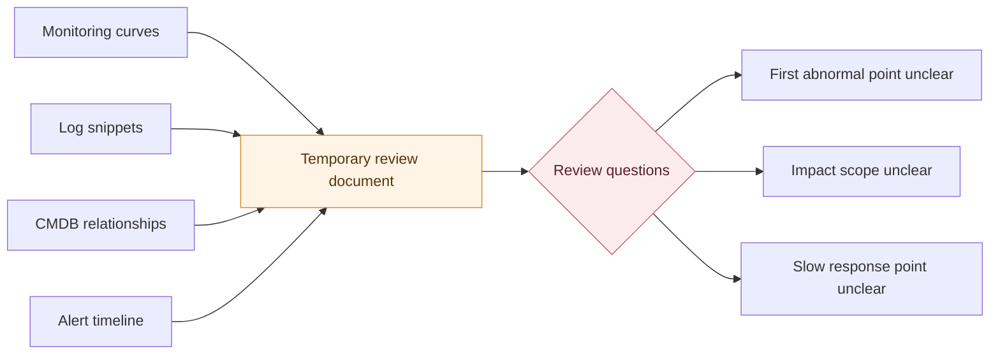
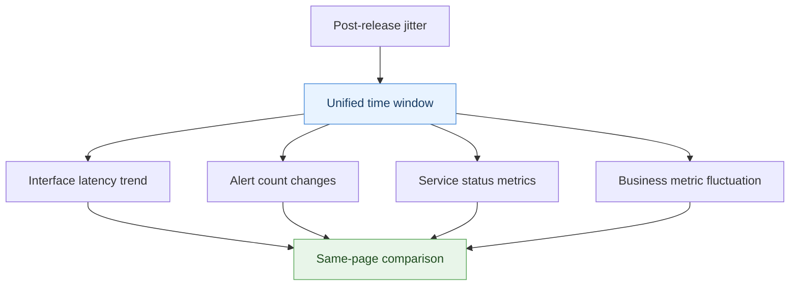
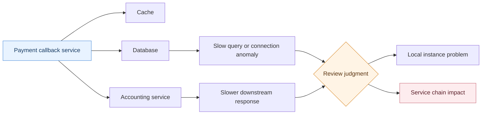
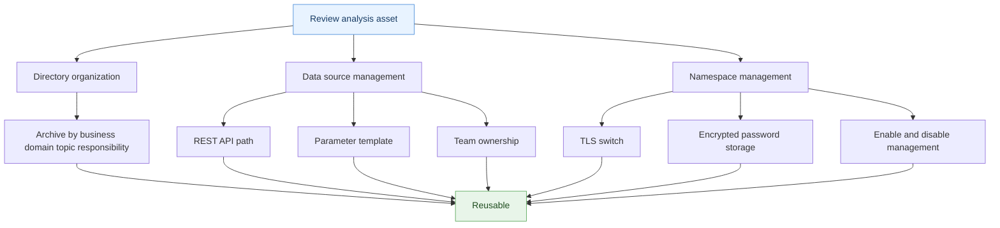

# Why Incident Reviews Cannot Reconstruct the Scene

## The Incomplete Picture Before the Morning Meeting

Twenty minutes before the morning meeting, operations lead Xiao Zhou is put on the spot.

After yesterday afternoon's release, the payment callback service jittered for more than ten minutes. The incident has recovered, and the business team has confirmed that transaction compensation is complete. But the review materials still cannot form one complete picture.

The monitoring engineer provides an interface latency curve.

The developer shares several error logs with request IDs.

CMDB can show relationships among payment callbacks, cache, database, and the downstream accounting service.

The alert list also has trigger, acknowledgment, and recovery timestamps.

The materials look complete. Then the review host asks one question:

> "Which point became abnormal first? Was the impact limited to one instance, one service chain, or the entire payment path?"

The room goes quiet for a few seconds.

It is not that nobody has data. Everyone only has one fragment. Xiao Zhou can explain any one screenshot, but it is hard to connect all screenshots into one continuous scene.

That is the most frustrating part of many incident reviews: **the evidence is there, but the scene is not.**

<!-- truncate -->

## The Root Cause: Data Never Enters the Same Judgment Chain

During troubleshooting, scattered systems can still be held together by people.

Xiao Zhou can look at monitoring curves first, search logs next, check asset relationships, and finally review alert records. While the incident is still active, opening several pages is tiring, but at least the investigation can move forward.

Reviews are different.

An incident review needs to answer one complete judgment chain:

- Where the abnormality first surfaced
- Which metrics changed first, and which logs appeared afterward
- Which services and resources were actually affected
- Why response actions slowed down at a certain point
- Whether this material can be reused next time

If these answers are scattered across different systems, the review degrades into screenshot organization. Everyone is proving "I have clues here," but no single picture tells the team how the incident unfolded step by step.

This diagram is not saying temporary documents are useless. It exposes the real problem: screenshots can pile evidence together, but they cannot automatically build relationships among evidence.

What Xiao Zhou lacks is not a fifth screenshot. It is an analysis scene that can be reused.

## Technical Insight: Reviews Are Evidence Orchestration, Not Material Archiving

What an incident review should preserve is not "where we put the screenshots this time," but three capabilities:

- **Time alignment**: Can different data return to the same time basis?
- **Relationship location**: Can abnormal objects be placed in the same structure as upstream and downstream dependencies?
- **Asset reuse**: Can this analysis become an entry for the next review, inspection, or thematic analysis?

As long as these three capabilities do not become stable assets, reviews will keep relying on manual stitching.

The value of BK Lite Operations Analytics should be understood along this chain. It does not replace monitoring, logs, CMDB, or alerts. It places scattered clues into one analysis space so a temporary analysis has a chance to become a maintainable analysis asset.

## One: Time Does Not Align

Xiao Zhou gets stuck on time first.

The monitoring curve shows jitter starting at 15:07. The first obvious error in logs appears at 15:09. The alert list records the trigger time as 15:10. Each timestamp is correct, but when placed together, everyone still has to confirm repeatedly: are these times in the same window? Did someone capture the wrong range? Did someone only capture the curve after recovery?

This kind of blockage is common.

An incident review is not about placing several charts side by side. It is about letting different metrics explain each other on the same timeline. If time bases are inconsistent, impact scope judgment and response process analysis both slow down.

### Use a Unified Time Window to Hold the First Round of Evidence

Dashboards in Operations Analytics are well suited to this kind of time alignment problem.

They support line charts, bar charts, pie charts, and single-value charts, as well as global time selectors and shared filters. For Xiao Zhou, this means alert trends, service status, resource counts, and business metrics can be observed on one page instead of each screenshot using its own time range.

This step does not directly produce the root cause.

It first pulls the review back from "everyone looks at their own chart" into one shared time window.

The key point in this diagram is not "more charts." It is that all charts first return to the same review basis. Only after time is aligned is the team qualified to discuss what changed first and what changed later.

## Two: Relationships Do Not Connect

After time alignment, Xiao Zhou runs into the second problem: impact scope is unclear.

The payment callback service is abnormal. Logs contain database timeouts, and monitoring also shows slower downstream responses. But is this jitter inside the payment service itself, drag from the downstream accounting service, or only a local problem on one instance?

Metrics alone are not enough to answer this.

Metrics tell you "something changed," but they do not naturally tell you "who it is related to." In reviews, teams often switch to verbal explanation here: which database, cache, and downstream API a service depends on, who changed something recently, and which node should be checked first.

The more verbal explanation there is, the harder the review is to reuse.

### Use Topology to Put Abnormal Objects and Dependencies on One Screen

Topology diagrams in Operations Analytics are well suited to relationship location.

They support icon nodes, text nodes, single-value nodes, chart nodes, and edges, so they can express object relationships, dependency paths, and node states. Single-value and chart nodes can also bind data sources, making the topology more than a static structure with key status attached.

For Xiao Zhou, this diagram is not meant to answer "what does the system architecture look like?" It is meant to answer "which objects became related through this abnormality?"

This diagram compresses one of the most time-consuming verbal explanations in reviews: who depends on whom, whose state is abnormal, and whether the abnormality spread along relationships.

When relationships and states sit in the same diagram, impact scope no longer depends only on "I remember it should be like this."

## Three: Structure Does Not Stay

Xiao Zhou finishes sorting out time and relationships, and the review materials finally look close to complete.

Then another problem appears: can this diagram be reused next time?

Many teams' architecture diagrams only live inside one review. After the meeting, nobody maintains them. Before the next release, nobody knows whether they are still trustworthy. Worse, cross-cloud resources, system layers, and before-and-after change structures must be redrawn every time. Reviews remain stuck at "explaining the background again."

What reviews really need is not a one-time drawing, but a long-term maintainable structure asset.

### Use Architecture Diagrams to Preserve Review Context

Architecture diagrams in Operations Analytics are better for expressing relatively static resource structures.

They can support system architecture display, resource inventory, solution review, and before-and-after structural comparison. Compared with topology diagrams, which focus on dynamic relationships, architecture diagrams are better for preserving cross-cloud resource distribution, system layers, platform components, and CMDB resource icons as maintainable canvases.

This means Xiao Zhou does not need to explain the whole system from zero every time.

During the review, the team looks at the incident scene. After the review, it keeps a structure asset.

## Four: Boundaries Are Not Governed

When Xiao Zhou prepares to hand this page to the team for reuse, the final layer appears.

Who can view it? Who can edit it? Where does the data come from? Which parameters can users adjust? Is cross-environment data access secure? If these questions have no boundaries, the review page quickly falls back into a personal bookmark or becomes another temporary page nobody dares to maintain.

This step may seem less urgent than the previous problems, but it determines whether analysis assets can stay alive.

### Use Directories, Data Sources, and Namespaces to Guard Reuse Boundaries

Operations Analytics uses a directory tree to manage directories, dashboards, topology diagrams, and architecture diagrams in one place. It supports organizing analysis assets by business domain, topic, or responsibility scope. Directory depth constraints prevent pages from spreading endlessly.

Data source management defines REST API paths, parameter templates, chart types, data source tags, and team ownership. Namespace management maintains connection information and supports TLS switches, encrypted password storage, and enable or disable controls.

These capabilities are not the review conclusion itself. They are the boundaries that keep review assets trustworthy over time.

These layers are not decorative. Directories, data sources, and namespaces jointly determine whether a review page can move from "usable this time" to "usable next time."

## Connecting the Layers

Back to Xiao Zhou's review.

If he only has scattered screenshots from monitoring, logs, CMDB, and alerts, he can only keep explaining each chart. Once those clues are organized into analysis assets, the review path becomes clearer:

- Use dashboards to place metrics, alerts, and business status under the same time basis
- Use topology diagrams to place abnormal objects and upstream/downstream relationships into the same structure
- Use architecture diagrams to preserve long-term structures and avoid explaining background from zero each time
- Use directories, data sources, and namespaces to put the whole page under maintainable boundaries

This does not automate root cause analysis.

It solves the step before root cause analysis: letting evidence stand inside the same scene first.

## Questions to Ask Before Starting

If a team wants to move incident reviews from "material packages" to "analysis assets," it can first ask itself:

| Question | If the answer is unclear, what happens in the review |
| --- | --- |
| Can key metrics be viewed in the same time window? | Teams debate who became abnormal first and later |
| Can abnormal objects and upstream/downstream relationships be shown together? | Impact scope depends on verbal explanation |
| Can architecture and resource structures be maintained long term? | Every review has to explain background again |
| Are data sources, parameters, and team ownership clear? | Analysis pages degrade into personal bookmarks |
| Is there a security boundary for cross-environment connections? | The more pages are preserved, the harder access risk becomes to control |

These questions are not complicated, but they are easy to miss.

The quality gap in incident reviews often appears in exactly these details.

## Conclusion

When incident reviews cannot reconstruct the scene, it is usually not because data is absent.

What is really missing is the ability to organize data into a scene.

Monitoring, logs, CMDB, and alerts each provide clues. What BK Lite Operations Analytics adds is the relationship among those clues: dashboards align time, topology diagrams express impact scope, architecture diagrams preserve structure, and directory, data source, and namespace governance keep analysis assets reusable.

At the next review meeting, the team should discuss why the problem happened, not first confirm "where that screenshot came from."
